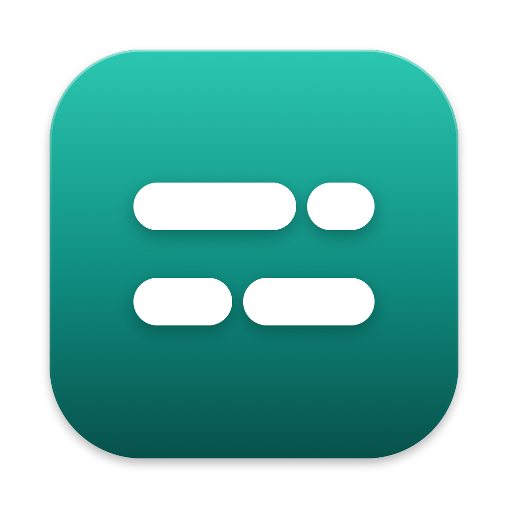
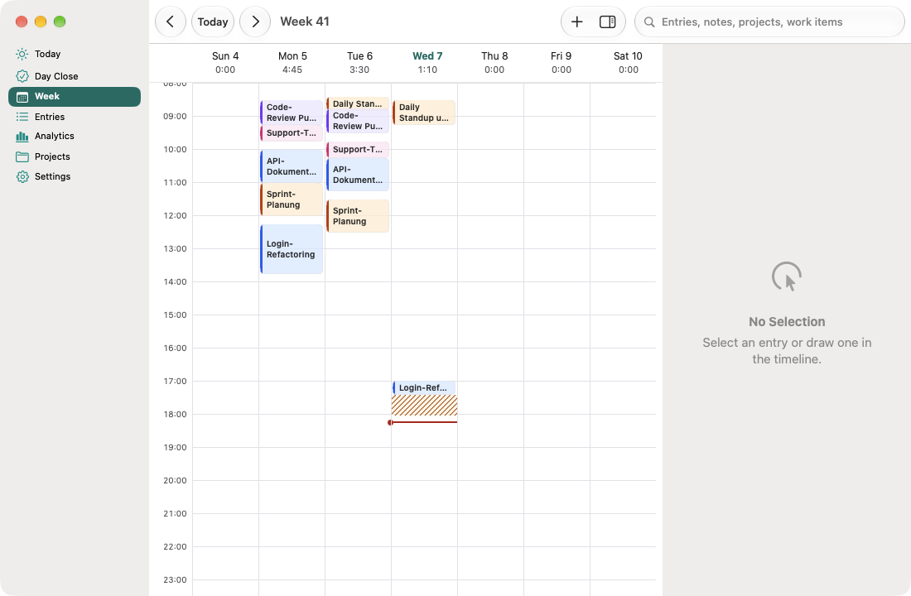
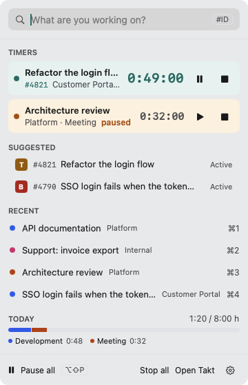
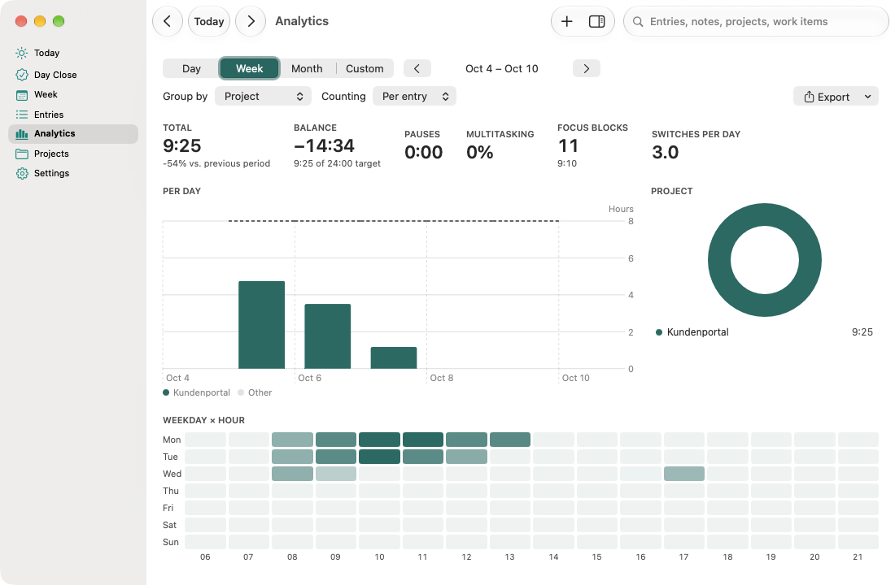
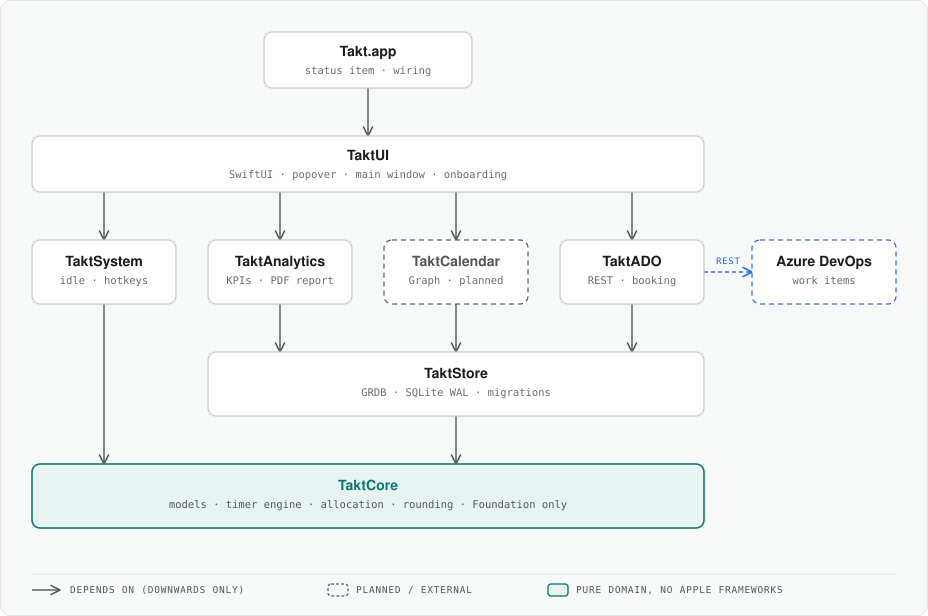

<div align="center">



# Takt

**Track time without losing your rhythm.**<br>
A native macOS time tracker that lives in your menu bar, keeps every byte on your Mac, and books time straight into Azure DevOps.

[](https://github.com/nimble-123/takt/releases/latest)
[](https://github.com/nimble-123/takt/releases)
[](https://github.com/nimble-123/takt/actions/workflows/ci.yml)
[](LICENSE)
[](#getting-started)
[](https://www.swift.org)
[](#why-takt)
[](https://www.conventionalcommits.org/en/v1.0.0/)
[](https://github.com/nimble-123/takt/commits/main)

[Features](#features) · [Architecture](#architecture) · [Install](#install) · [Getting started](#getting-started) · [Documentation](#documentation) · [Contributing](#contributing) · [License](#license)

</div>

> [!NOTE]
> Takt is pre-release: phases 1–3 are implemented, except Entra ID sign-in and the Outlook calendar. Releases ship an unsigned Apple Silicon build; see [Install](#install).

<div align="center">

<picture>
  <source media="(prefers-color-scheme: dark)" srcset="docs/assets/screenshots/week-dark.png">
  
</picture>

<table>
  <tr>
    <td align="center" valign="top">
<picture>
  <source media="(prefers-color-scheme: dark)" srcset="docs/assets/screenshots/popover-dark.png">
  
</picture>
    </td>
    <td align="center" valign="top">
<picture>
  <source media="(prefers-color-scheme: dark)" srcset="docs/assets/screenshots/analytics-dark.png">
  
</picture>
    </td>
  </tr>
</table>

</div>

## Why Takt

Time tracking usually happens after the fact and from memory, because starting, switching and booking cost too many clicks. Takt makes it as casual as glancing at a clock:

- **Zero friction.** The goal: a timer running in under two seconds, without touching the mouse.
- **Local-first and private.** No cloud and no backend. Your entries stay in a SQLite file on your Mac.
- **Honest time.** Pauses, idle time and parallel work are recorded explicitly instead of being smoothed over.
- **Native.** Swift 6, SwiftUI and AppKit. It feels like an Apple app and stays light on resources.
- **No double entry.** Tracked time becomes analytics and Azure DevOps bookings without re-typing it.

## Features

| | |
| --- | --- |
| **Menu bar first** | Start, switch, pause and stop from a popover. Open it with a global shortcut (default `⌥⇧T`), search, press Enter. |
| **Parallel timers** | Run several timers at once and count overlapping time as *full* or *split* by weight (e.g. 70/30), globally or per entry. |
| **Pauses and idle detection** | Per-timer and global pauses. When you come back from an idle period, keep, discard, count as pause or reassign the time. |
| **Rules** | Assign category, project and tags automatically, for example "work item type Bug → category Support". |
| **Azure DevOps** | Search work items, get suggestions from your checked-out Git branch, and book time back as **differences** that stay correct when you edit entries later. |
| **Analytics** | Stacked bars, distributions, heatmap, focus blocks and context switches, plus CSV, JSON and a PDF report against your weekly target hours. |
| **Enterprise ready** | Managed preferences and a sample profile for rollout via Intune or Jamf ([MDM guide](docs/MDM.md)). |

## Architecture

Eight modules in five layers. Dependencies only ever point downwards, and the domain layer knows nothing about Apple frameworks, so `TaktCore` and `TaktStore` are also tested on Linux in CI.

<div align="center">
  <picture>
    <source media="(prefers-color-scheme: dark)" srcset="docs/assets/architecture-dark.svg">
    
  </picture>
</div>

A few rules shape the codebase:

- **Raw data, not derivations.** Only time segments are stored (UTC milliseconds). Counting mode, rounding and booking amounts are computed at query time, so history stays correctable.
- **Time only through `TaktClock`.** Tests run on a manual clock, never on the wall clock.
- **One command, one transaction.** The timer engine writes exclusively through `TimerStore.update(_:)`.
- **Differential bookings.** Azure DevOps updates are `test /rev` patches with a `sync_record`, never absolute values, so they are idempotent and reproducible.
- **Secrets in the Keychain only.** Titles, notes and tokens never appear in logs.

The full picture is in the [technical concept](docs/TECHNICAL_CONCEPT.md).

## Install

With [Homebrew](https://brew.sh), from the [nimble-123/tap](https://github.com/nimble-123/homebrew-tap) tap:

```bash
brew tap nimble-123/tap
brew install --cask takt
```

Update with `brew upgrade --cask takt`. Every release updates the cask automatically, usually within minutes.

Or download `Takt-<version>-arm64.dmg` from the [latest release](https://github.com/nimble-123/takt/releases/latest) and drag Takt into Applications. It runs on Apple Silicon with macOS 26 or later.

> [!IMPORTANT]
> These builds are not signed or notarized yet, so macOS blocks the first launch. Open **System Settings → Privacy & Security** and click **Open Anyway**, or run `xattr -dr com.apple.quarantine /Applications/Takt.app`. After each update macOS asks again for access to the Keychain.

## Getting started

Build from source. Requirements: macOS 26, Xcode 26 and [XcodeGen](https://github.com/yonaskolb/XcodeGen).

```bash
brew install xcodegen
xcodegen generate            # creates Takt.xcodeproj (not checked in)
open Takt.xcodeproj
```

Run the package tests without opening Xcode:

```bash
swift test --package-path Packages/TaktKit
```

### Try it with sample data

```bash
scripts/run-local.sh                          # build and start with your real data
scripts/run-local.sh --test --seed            # separate data folder ~/takt-test with two weeks of sample entries
scripts/run-local.sh --test --seed --clean    # recreate the sample data
scripts/run-local.sh --no-build --logs        # start without building and follow the log
```

In test mode your entries stay separate. Settings, Azure DevOps connections and the Keychain are shared with the real app. `scripts/run-local.sh --help` lists all options.

## Documentation

The project documentation is written in German.

| Document | Contents |
| --- | --- |
| [PRD](docs/PRD.md) | Goals, requirements with IDs, release plan, decisions |
| [Technical concept](docs/TECHNICAL_CONCEPT.md) | Modules, database schema, timer engine, Azure DevOps booking flow, tests |
| [Design](docs/DESIGN.md) | Screens, colors, typography, interaction rules |
| [Releasing](docs/RELEASING.md) | Versioning, release PRs, signing and notarization |
| [MDM](docs/MDM.md) | Managed settings and rollout with Intune or Jamf |
| [CLAUDE.md](CLAUDE.md) | Working rules for Claude Code and everyone else |

## Contributing

Contributions are welcome. Work is tracked in issues and three milestones: `Phase 1 · Erfassen`, `Phase 2 · Azure DevOps` and `Phase 3 · Ausbau`.

1. Pick or open an issue and branch from `main` as `feat/<issue>-<name>` or `fix/<issue>-<name>`.
2. Keep PRs small, one topic each, and reference requirement IDs from the PRD (e.g. `TM-05`).
3. Run `swift test --package-path Packages/TaktKit` and `swift format lint --strict --recursive App Packages` before you push.
4. PR titles follow [Conventional Commits](https://www.conventionalcommits.org/en/v1.0.0/) and are squash-merged. [release-please](https://github.com/googleapis/release-please) creates versions, tags and the changelog automatically.

## License

[MIT](LICENSE) © 2026 Nils Lutz
