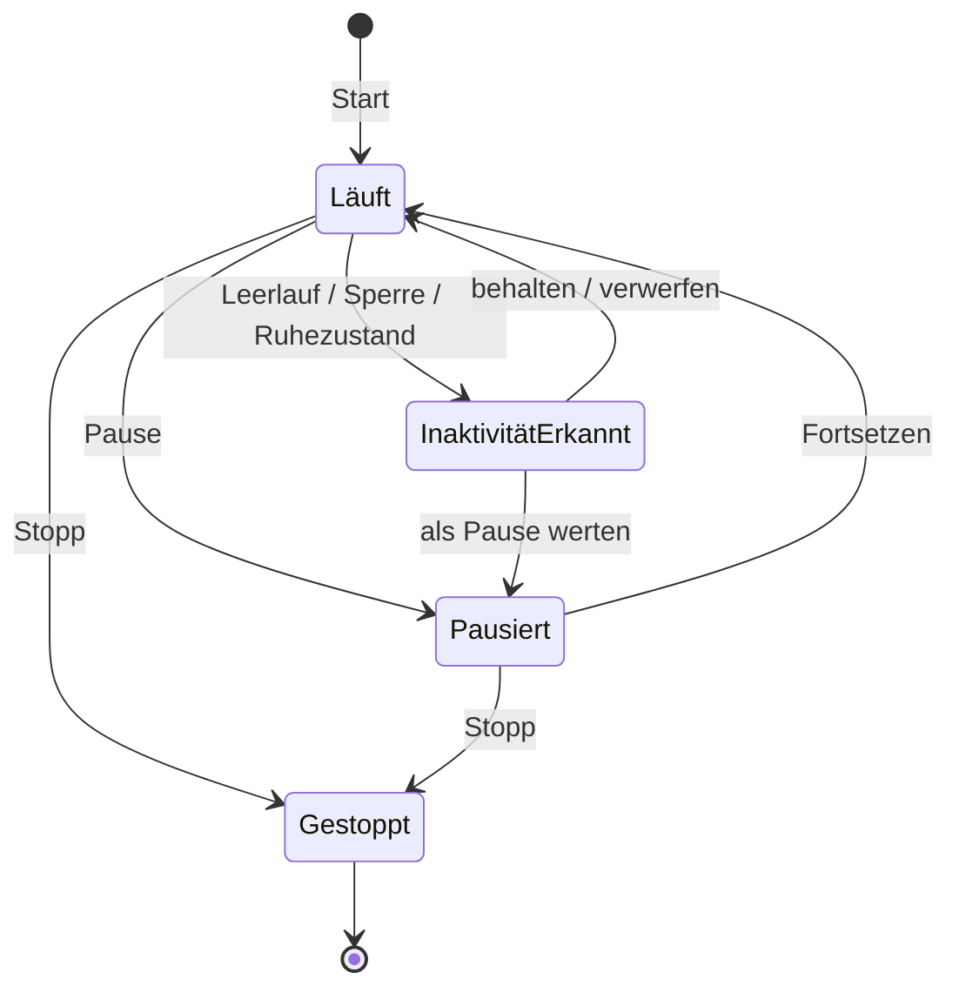

# PRD – Takt (macOS Time Tracker)

Stand: 6. Oktober 2026 · Autor: Nils Lutz · Status: freigegeben für die Umsetzung
Lebende Fassung: https://claude.ai/code/artifact/72e73d59-1326-4b3d-9f2f-f415e02cdec5

## Überblick & Vision

Takt ist ein nativer macOS-Timetracker für Teams, der Zeit mit einem Shortcut aus der Menüleiste startet, alle Daten lokal hält und gebuchte Zeit direkt in Azure DevOps Work Items zurückschreibt.

**Problem.** Zeiterfassung passiert meist nachträglich und geschätzt, weil Starten, Wechseln und Buchen zu viele Klicks kosten. Parallele Tätigkeiten (Meeting plus Ticket nebenbei) und Pausen bildet kaum ein Tool sauber ab. In Azure DevOps wird Zeit ein zweites Mal von Hand gepflegt.

**Vision.** Zeit erfassen ist so beiläufig wie ein Blick auf die Uhr. Die App merkt, wenn etwas nicht stimmt (vergessener Timer, Inaktivität), und macht aus erfasster Zeit ohne Doppelarbeit Analysen und ADO-Buchungen.

**Zielgruppe.** Teams in Unternehmen, die mit Azure DevOps arbeiten: Entwickler, Architekten, Berater, Leads. Jede Person erfasst lokal auf ihrem Mac; die gemeinsame Ebene im Team ist Azure DevOps, kein eigenes Backend.

**Leitprinzipien**

- **Zero Friction:** Timer läuft in unter 2 Sekunden, ohne Maus.
- **Local-first & Privacy:** Keine Cloud, keine Telemetrie ohne Opt-in, keine Überwachungsfunktionen.
- **Ehrliche Zeit:** Pausen, Inaktivität und Parallelarbeit werden explizit erfasst, nicht geschönt.
- **Native statt Electron:** fühlt sich an wie eine Apple-App, braucht kaum Ressourcen.
- **Nicht unterbrechen:** Hinweise nur, wenn sie Datenqualität retten.

## Ziele, Nicht-Ziele & Erfolgsmetriken

Version 1 ist erfolgreich, wenn das Team Zeit live statt nachträglich erfasst und ADO-Zeitbuchungen nicht mehr von Hand pflegt.

**Ziele**

1. Zeit erfassen ohne Kontextwechsel: Menüleiste und globaler Shortcut reichen für 90 % der Interaktionen.
2. Pausen und Multitasking korrekt abbilden, mit konfigurierbarer Zählweise.
3. Aussagekräftige Analysen nach Zeit, Projekt, Kategorie, Tag und Work Item.
4. Verknüpfen von Work Items und Zurückschreiben der Zeit in Azure DevOps.
5. Leichtgewichtig: geringer Speicher- und Energiebedarf, schneller Start.

**Nicht-Ziele (v1)**

- Kein eigenes Backend, kein Team-Dashboard, kein Sync zwischen Geräten.
- Keine Abrechnung, Rechnungen oder Stundensätze.
- Kein automatisches App- oder Website-Tracking, keine Screenshots (Mitarbeiterüberwachung ist bewusst ausgeschlossen).
- Keine Apps für Windows, iOS oder Web.
- Keine Integrationen außer Azure DevOps und, optional, dem Outlook-Kalender.

**Erfolgsmetriken** (Zielwerte, lokal messbar)

| Metrik | Zielwert |
| --- | --- |
| Zeit vom Shortcut bis Timer läuft | ≤ 2 s |
| Popover öffnet nach Klick | ≤ 150 ms |
| Anteil nachträglich angelegter Einträge | < 20 % nach 4 Wochen Nutzung |
| ADO-Buchungen ohne manuelle Korrektur | ≥ 95 % |
| Speicherbedarf im Leerlauf | < 80 MB |
| CPU im Leerlauf | < 1 % |
| Absturzfreie Sitzungen | ≥ 99,5 % |

## Personas & Kern-Use-Cases

| Persona | Arbeitsalltag | Wichtigstes Bedürfnis |
| --- | --- | --- |
| Entwicklerin | Lange Fokusblöcke an Tasks und Bugs | Timer direkt am Work Item, Zeit automatisch gebucht |
| Architekt / Lead | Viele Meetings, Reviews, Kontextwechsel, parallele Themen | Multitasking und schnelle Wechsel ohne Datenmüll |
| Teamlead | Plant Kapazität, berichtet Aufwände | Saubere Daten in ADO, Export für Reports |

| ID | Situation | Erwartetes Verhalten |
| --- | --- | --- |
| UC-01 | Arbeit beginnen | Shortcut, zwei Buchstaben tippen, Enter: Timer läuft am richtigen Task |
| UC-02 | Mittagspause | Ein Klick pausiert alle laufenden Timer, ein Klick setzt sie fort |
| UC-03 | Meeting, nebenbei Ticket | Zweiter Timer startet parallel; Zählweise folgt der Einstellung |
| UC-04 | Vom Schreibtisch weg, Timer läuft weiter | Bei Rückkehr fragt die App, was mit der inaktiven Zeit passiert |
| UC-05 | Timer vergessen zu starten | Eintrag nachträglich in der Timeline aufziehen |
| UC-06 | Ticket in ADO verknüpfen | ID oder Titel tippen, Kompaktvorschau prüfen, verknüpfen |
| UC-07 | Tagesabschluss | Review der Einträge, gesammelte Buchung nach ADO mit einem Klick |
| UC-08 | Wochenrückblick | Verteilung nach Projekt und Kategorie, Vergleich zur Vorwoche |

## Funktionale Anforderungen

Die Menüleiste ist das Cockpit für das Erfassen, das Hauptfenster der Ort für Korrektur und Auswertung. Prioritäten nach MoSCoW: Must = MVP, Should = MVP wenn machbar, Could = später.

### Menüleiste

| ID | Anforderung | Prio |
| --- | --- | --- |
| MB-01 | Icon zeigt Status: kein Timer, läuft, pausiert; optional laufende Zeit als Text neben dem Icon | Must |
| MB-02 | Popover per Klick oder globalem Shortcut (Default ⌥⇧T, konfigurierbar) | Must |
| MB-03 | Suchfeld hat sofort Fokus; Vorschläge aus zuletzt genutzten Tasks, Projekten und ADO-Items; Enter startet | Must |
| MB-04 | Liste laufender Timer mit Pause, Fortsetzen, Stopp pro Timer und Live-Zeit | Must |
| MB-05 | Bis zu 5 Favoriten bzw. zuletzt genutzte Tasks als One-Click-Start | Must |
| MB-06 | Alle pausieren / alle fortsetzen / alle stoppen | Must |
| MB-07 | Notiz zum laufenden Eintrag inline ergänzen | Should |
| MB-08 | Tagessumme und Fortschritt zum Tagesziel | Should |
| MB-09 | Kürzel im Suchfeld beim Start: `@Kategorie`, `/Projekt` bzw. `/Projekt/Task`, `#Tag`, mit Vervollständigung und Chips; `#` nur mit Ziffern bleibt Work-Item-Suche | Should |

### Timer, Pausen & Multitasking

| ID | Anforderung | Prio |
| --- | --- | --- |
| TM-01 | Ein Eintrag besteht aus Segmenten (Start/Ende); Pausen erzeugen Lücken zwischen Segmenten | Must |
| TM-02 | Pausen pro Timer und global; Pausenzeit wird separat ausgewiesen | Must |
| TM-03 | Mehrere Timer laufen parallel | Must |
| TM-04 | Zählweise paralleler Zeit konfigurierbar: „Voll“ (jeder Timer zählt die volle Zeit) oder „Geteilt“ (gleichmäßig verteilt, Gewicht pro Eintrag änderbar, z. B. 70/30); global als Default, pro Eintrag überschreibbar | Must |
| TM-05 | Startverhalten konfigurierbar; Default „Wechseln“ (neuer Timer pausiert die laufenden), parallel starten per ⌥↩ | Must |
| TM-06 | Inaktivitätserkennung (Default 10 min): bei Rückkehr wählen zwischen behalten, verwerfen, als Pause werten, anderem Task zuordnen | Must |
| TM-07 | Ruhezustand, Bildschirmsperre und Neustart wie Inaktivität behandeln; laufende Timer überstehen Absturz und Neustart | Must |
| TM-08 | Warnung bei Timer, der länger als 10 h läuft | Should |
| TM-09 | Erinnerung, wenn während der Arbeitszeit kein Timer läuft | Should |
| TM-10 | Rundung (z. B. auf 15 min) nur für Export und ADO; Rohdaten bleiben sekundengenau | Should |
| TM-11 | Stopp beendet sofort und zeigt einen Toast mit „Notiz“ und „Rückgängig ⌘Z“; ein Beenden-Panel (Notiz, Kategorie, Buchungswahl) erscheint nur, wenn Pflichtangaben fehlen oder es bewusst geöffnet wird | Must |

Parallele Timer haben je einen eigenen Zustand; „Alle pausieren“ wirkt auf alle laufenden Timer.

### Projekte, Kategorien & Tags

| ID | Anforderung | Prio |
| --- | --- | --- |
| ST-01 | Projekt → optional Task; Kategorie unabhängig davon (z. B. Entwicklung, Meeting, Review, Support); freie Tags | Must |
| ST-02 | Farbe und SF Symbol pro Projekt und Kategorie | Should |
| ST-03 | Projekte selektiv aus ADO-Projekten und Area Paths übernehmen; zusätzlich eigene, private Projekte je Nutzer | Must |
| ST-04 | Archivieren statt Löschen, damit Historie erhalten bleibt | Must |
| ST-05 | Regeln, z. B. Work-Item-Typ Bug → Kategorie Support | Could |

### Hauptfenster

Seitenleiste mit Heute, Kalender, Einträge, Analysen, Projekte, Einstellungen.

| ID | Anforderung | Prio |
| --- | --- | --- |
| HW-01 | Tagesansicht als vertikale Timeline; parallele Timer als nebeneinanderliegende Spuren | Must |
| HW-02 | Einträge per Drag in der Timeline anlegen, verschieben, kürzen; Inspektor mit Segmenten, Zählweise, Gewicht, Notiz und Hinweis auf Differenzbuchungen | Must |
| HW-03 | Wochenansicht im Kalenderraster | Must |
| HW-04 | Eintragsliste mit Inline-Bearbeitung, Mehrfachauswahl und Sammelzuordnung | Must |
| HW-05 | Command Palette (⌘K) für alle Aktionen | Should |
| HW-06 | Volltextsuche über Notizen, Tasks und Work Items | Should |

### Analysen

| ID | Anforderung | Prio |
| --- | --- | --- |
| AN-01 | Zeitraum: Tag, Woche, Monat, frei; Vergleich zur Vorperiode | Must |
| AN-02 | Dimensionen: Projekt, Kategorie, Datum, Wochentag, Tags, Work Item, Tageszeit | Must |
| AN-03 | Gestapelte Balken pro Tag, Verteilung als Donut oder Treemap, Heatmap Wochentag × Stunde | Should |
| AN-04 | Kennzahlen: Gesamtzeit, Pausenzeit, Multitasking-Anteil, Fokusblöcke (≥ 25 min ununterbrochen), Kontextwechsel pro Tag | Should |
| AN-05 | Drilldown vom Diagramm zu den zugrunde liegenden Einträgen | Should |
| AN-06 | Export als CSV und JSON | Must |
| AN-07 | PDF-Report und Soll/Ist gegen Wochenstunden | Could |

## Azure DevOps Integration

Work Items werden per Suche oder Vorschlag mit Einträgen verknüpft; die erfasste Zeit wird nach einem Review als Completed Work ins Work Item zurückgeschrieben, ohne Doppelbuchungen.

### Verbindung & Authentifizierung

| ID | Anforderung | Prio |
| --- | --- | --- |
| DO-01 | Anmeldung per Personal Access Token ab dem ersten Release; Microsoft Entra ID (OAuth), sobald die App-Registrierung freigegeben ist | Must |
| DO-02 | Mehrere Organisationen und Projekte; Default-Projekt pro App-Projekt | Should |
| DO-03 | Tokens ausschließlich im macOS-Schlüsselbund; minimale Berechtigung (Work Items lesen und schreiben) | Must |

### Suche & Kompaktvorschau

| ID | Anforderung | Prio |
| --- | --- | --- |
| DO-10 | Suche nach ID (`#1234` oder `1234`) und Titel, direkt im Startfeld von Menüleiste und Hauptfenster | Must |
| DO-11 | Ergebnisse nach 250 ms Tipp-Pause; lokaler Cache der zuletzt gesehenen Items für sofortige Treffer | Must |
| DO-12 | Kompaktvorschau pro Treffer: Typ-Icon, ID, Titel, Status, zugewiesene Person, Iteration, Remaining und Completed Work, Parent | Must |
| DO-13 | Leertaste öffnet Detailvorschau (Beschreibungsauszug, Tags); ⌘↩ öffnet das Item im Browser | Should |
| DO-14 | Item verknüpfen setzt optional Projekt und Kategorie per Regel | Could |

### Vorgeschlagene Items

Ohne Eingabe zeigt das Startfeld eine kurze, priorisierte Vorschlagsliste:

1. Mir zugewiesen, aktuelle Iteration aller meiner Teams, Status „Active“ bzw. „In Progress“.
2. Zuletzt in der App verwendete Items.
3. Kürzlich von mir geänderte Items.
4. Optional (Could): Item-ID aus dem aktuellen Git-Branchnamen, z. B. `feature/1234-login`.

### Zeit zurückschreiben

| ID | Anforderung | Prio |
| --- | --- | --- |
| DO-20 | Zeit eines Eintrags erhöht das Feld Completed Work des verknüpften Items | Must |
| DO-21 | Buchungsmodus wählbar: manuell pro Eintrag, Tagesabschluss-Review (Default) oder automatisch beim Stoppen | Must |
| DO-22 | Optional Remaining Work um dieselbe Zeit reduzieren (nicht unter 0) | Should |
| DO-23 | Optionaler Kommentar am Item mit Datum, Dauer und Notiz | Should |
| DO-24 | Sync-Protokoll pro Eintrag: Änderungen nach der Buchung werden als Differenz nachgebucht, nie doppelt | Must |
| DO-25 | Konfliktschutz über die Revision des Work Items; bei Konflikt neu laden und erneut anwenden | Must |
| DO-26 | Offline-Warteschlange; Buchung erfolgt, sobald die Verbindung steht | Must |
| DO-27 | Zielfeld pro ADO-Projekt und Work-Item-Typ, zur Laufzeit aus ADO erkannt (gemischte Prozess-Templates); Fallback: nur Kommentar | Must |

Completed Work ist in ADO eine einzige kumulierte Zahl, keine Liste von Zeitbuchungen. Die Einzelbuchungen und damit die Nachvollziehbarkeit liegen deshalb im lokalen Sync-Protokoll der App.

## Outlook-Kalender (optional, Phase 3)

Takt liest auf Wunsch den Outlook-Kalender und zeigt Termine in derselben Suche wie Work Items. Regeltermine wie das Daily werden einmal zugeordnet und danach automatisch richtig gebucht.

### Anbindung

| ID | Anforderung | Prio |
| --- | --- | --- |
| CA-01 | Optional, standardmäßig aus; einschalten in den Einstellungen oder im Onboarding | Must |
| CA-02 | Zugriff über Microsoft Graph mit derselben Entra-ID-Anmeldung; nur Leserecht auf den eigenen Kalender | Must |
| CA-03 | Fallback über den macOS-Kalender, wenn das Exchange-Konto dort eingebunden ist | Could |
| CA-04 | Gelesen werden nur Titel, Start, Ende, Serien-ID, Teilnehmerzahl und Online-Meeting-Kennzeichen; private Termine erscheinen nur als „Privat“ | Must |
| CA-05 | Lokaler Cache für heute ± 7 Tage; Abgleich alle 5 min und beim Öffnen des Popovers | Should |

### Suche & Vorschläge

| ID | Anforderung | Prio |
| --- | --- | --- |
| CA-10 | Das Startfeld durchsucht Work Items und Termine gemeinsam; Termine erscheinen als eigene Gruppe „Kalender“ | Must |
| CA-11 | Ohne Eingabe steht der laufende oder in den nächsten 15 min beginnende Termin ganz oben | Must |
| CA-12 | Kompaktvorschau eines Termins: Zeit, Dauer, Serie, Teilnehmer, Online-Meeting, gespeicherte Zuordnung | Should |
| CA-13 | Ein Timer aus einem Termin übernimmt Titel und Zuordnung; hat der Termin vor bis zu 10 min begonnen, startet der Timer rückwirkend zum Terminbeginn | Must |
| CA-14 | Abgesagte oder abgelehnte Termine werden nicht vorgeschlagen | Must |

### Regeltermine

| ID | Anforderung | Prio |
| --- | --- | --- |
| CA-20 | Zuordnung pro Serie: Projekt, Kategorie, optional Work Item; gilt für alle künftigen Termine der Serie | Must |
| CA-21 | Optionaler Hinweis zum Terminbeginn („Daily beginnt – Timer starten?“); beim Start pausiert die laufende Arbeit | Should |
| CA-22 | Option pro Serie: Timer endet mit dem Termin, danach läuft die vorher pausierte Arbeit weiter; „Verlängern“ für Überzieher | Should |
| CA-23 | Die Tagesansicht zeigt nicht erfasste Termine als blasse Vorschläge, die per Klick übernommen werden | Could |

## UX- & Design-Prinzipien

Die App folgt der aktuellen macOS-Designsprache und ist vollständig per Tastatur bedienbar; jede Ansicht hat genau eine Hauptaktion. Details und Screens: [DESIGN.md](DESIGN.md).

- **Keyboard-first:** Jede Aktion hat einen Shortcut oder ist über ⌘K erreichbar.
- **Eine Hauptaktion pro Ansicht:** Im Popover ist das Starten, im Review das Buchen.
- **Undo statt Rückfragen:** Löschen, Stoppen und Verschieben sind sofort und per ⌘Z rückgängig zu machen.
- **Progressive Disclosure:** Tags, Notizen, Regeln und Rundung erscheinen erst, wenn man sie braucht.
- **Live und ruhig:** Laufende Zeit tickt sichtbar, Statuswechsel sind dezent animiert, Benachrichtigungen nur bei Inaktivität, Langläufern und Tagesabschluss.
- **Native Details:** Hell- und Dunkelmodus, VoiceOver, ausreichende Kontraste, Deutsch und Englisch.

| Aktion | Shortcut |
| --- | --- |
| Popover öffnen (global) | ⌥⇧T |
| Alle pausieren / fortsetzen (global) | ⌥⇧P |
| Command Palette | ⌘K |
| Fokussierten Timer pausieren / fortsetzen | Leertaste |
| Parallel starten | ⌥↩ |
| Neuer Eintrag | ⌘N |
| Work Item im Browser öffnen | ⌘↩ |

**Onboarding** in unter 60 Sekunden, drei Schritte:

1. Azure DevOps per Personal Access Token verbinden (überspringbar) und Projekte übernehmen.
2. Globalen Shortcut live ausprobieren.
3. Startverhalten und Zählweise wählen, jeweils mit einem Mini-Beispiel.

## Nicht-funktionale Anforderungen

| Bereich | Anforderung |
| --- | --- |
| Performance | Kaltstart < 1 s; Popover < 150 ms; Analyse über 12 Monate < 500 ms |
| Ressourcen | < 80 MB RAM und < 1 % CPU im Leerlauf; Timer-Anzeige ohne Dauer-Polling |
| Robustheit | Jeder Zustandswechsel wird sofort gespeichert; laufende Timer überstehen Absturz, Neustart und Update |
| Datenschutz | Daten nur lokal in Application Support; keine Telemetrie ohne Opt-in; Tokens im Schlüsselbund |
| Datensicherheit | Automatische lokale Backups (täglich, 14 Generationen); Export und Import als JSON |
| Team ohne Backend | Projekte selektiv aus ADO übernommen; eigene Projekte und Kategorien lokal je Nutzer |
| Barrierefreiheit | VoiceOver-Labels, Tastaturbedienung, Kontraste nach WCAG AA |
| Plattform | macOS 26 oder neuer |

Architektur, Datenmodell und Technologie: [TECHNICAL_CONCEPT.md](TECHNICAL_CONCEPT.md).

## Release-Plan

| Phase | Inhalt | Gate danach |
| --- | --- | --- |
| 1 · Erfassen (MVP) | Menüleiste und Shortcut, Timer/Pausen/Multitasking, Inaktivität, Projekte und Kategorien, Timeline Tag und Woche, nachträgliches Bearbeiten, Basis-Analysen, CSV-Export, Onboarding | Phase 1 stabil im eigenen Pilot |
| 2 · Azure DevOps (MVP) | Login per PAT (Entra später), Suche und Kompaktvorschau, Vorschläge, Rückschreiben mit Tagesabschluss, Sync-Protokoll und Offline-Queue | Pilot erfolgreich → Team-Rollout |
| 3 · Ausbau | ⌘K und Volltextsuche, Heatmap und Fokusblöcke, Regeln und PDF-Report, Vorschläge aus Git-Branch, Team-Profile per MDM, Outlook-Kalender | – |

Betriebsrat und Datenschutz haben das Zurückschreiben nach ADO freigegeben.

## Entscheidungen

| Thema | Entscheidung |
| --- | --- |
| Betriebsrat und Datenschutz | Zurückschreiben nach ADO ist freigegeben |
| ADO-Prozess-Templates | Gemischt; Zielfeld pro Projekt und Work-Item-Typ, zur Laufzeit erkannt |
| Bestehende ADO-Zeiterfassung | Keine Extension im Einsatz; die App bucht direkt in Work-Item-Felder |
| Anmeldung | PAT ab Release 1; Entra ID nach Freigabe der App-Registrierung (beantragt) |
| macOS-Mindestversion | macOS 26 |
| Startverhalten | Default „Wechseln“, parallel per ⌥↩ |
| Modus „Geteilt“ | Gleichmäßig, Gewicht pro Eintrag änderbar |
| Verteilung | MDM (Intune/Jamf), notarisiert mit privatem Developer-ID-Account, Bundle-ID `de.nilslutz.takt` |
| Team-Struktur | Projekte selektiv aus ADO übernehmen, zusätzlich eigene je Nutzer |
| Persistenz | SQLite über GRDB |
| Kalender | Outlook über Microsoft Graph, Phase 3 |

**Offen**

- [ ] Verfügbarkeit von „Takt“ prüfen: Domain, Markenregister (DPMA/EUIPO)
- [ ] Mit der IT klären, ob Graph-Lesezugriff auf den Kalender per Admin-Zustimmung freigegeben wird
- [ ] Datenschutz bestätigen lassen, dass das Lesen von Kalendertiteln von der bestehenden Freigabe gedeckt ist
- [ ] Mit Arbeitgeber und IT klären, dass eine privat entwickelte und signierte App per MDM verteilt werden darf und wem die Rechte am Code gehören
