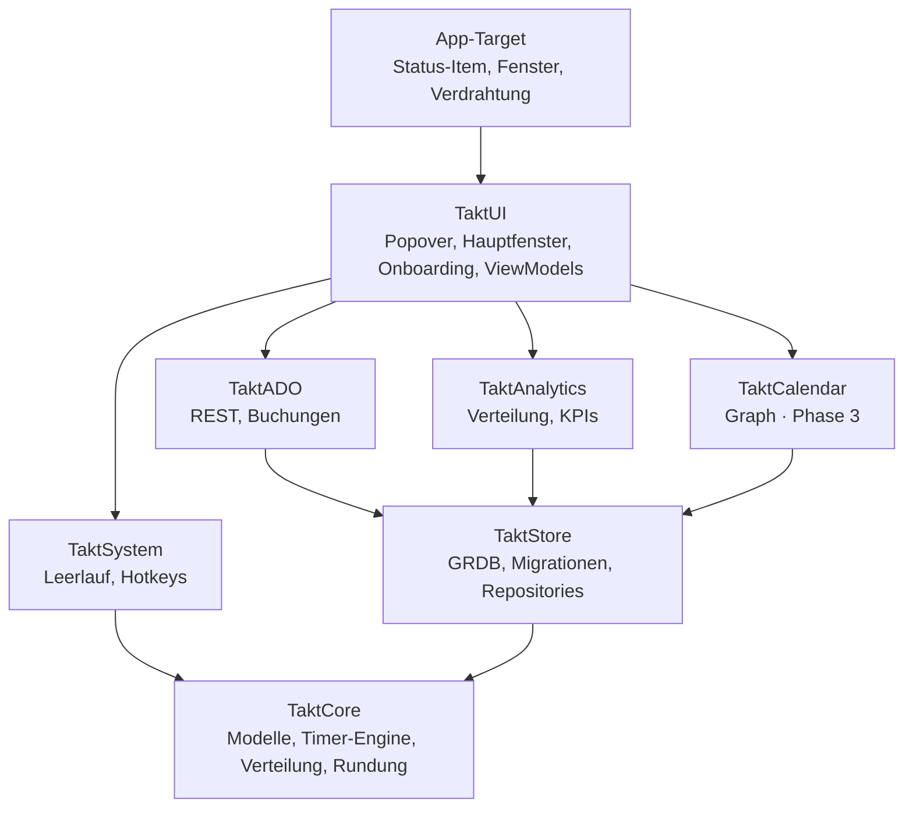
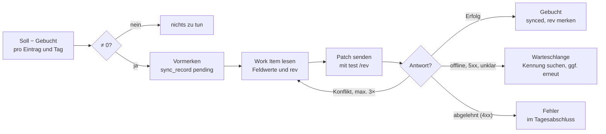

# Takt – Technisches Konzept

Stand: 6. Oktober 2026 · Grundlage: [PRD.md](PRD.md)
Lebende Fassung: https://claude.ai/code/artifact/b71f0458-a7d0-4310-a76f-d499dbcd9231

Takt wird eine native Swift-6-App aus wenigen klar getrennten Modulen: eine reine Domänenschicht mit Timer-Engine, eine GRDB-Persistenz und austauschbare Adapter für System, Azure DevOps und später den Kalender.

## Leitentscheidungen

Gespeichert werden nur rohe UTC-Zeitsegmente; alles Abgeleitete (Zählweise, Rundung, Buchungsbeträge) wird zur Abfragezeit berechnet. Das hält die Daten korrigierbar und die Buchungen reproduzierbar.

| Thema | Entscheidung | Begründung |
| --- | --- | --- |
| Plattform | macOS 26+, Swift 6 mit strikter Concurrency | Aktuelle APIs, ein Design-Pfad, Datenrennen zur Compile-Zeit ausgeschlossen |
| UI-Shell | AppKit `NSStatusItem` + `NSPanel` mit SwiftUI-Inhalt | Popover per Hotkey öffnen und Laufzeit im Menüleisten-Titel zeigen; `MenuBarExtra` kann beides nur eingeschränkt |
| UI-Zustand | SwiftUI mit `@Observable`-Modellen | Wenig Boilerplate, gezielte Neuzeichnung |
| Persistenz | SQLite über GRDB 7, `DatabasePool` im WAL-Modus | Schnelle Aggregationen, explizite Migrationen, `ValueObservation` für reaktive UI |
| Zeitmodell | Segmente mit Start/Ende in UTC-Millisekunden; Tagesgrenzen in lokaler Zeitzone | Sommerzeit- und Reise-sicher |
| Zählweise & Rundung | Zur Abfragezeit berechnet, nie gespeichert | Rückwirkend änderbar, keine Datenmigration |
| Nebenläufigkeit | Timer-Engine und Sync als `actor`; UI auf `@MainActor` | Serialisierte Zustandswechsel ohne Locks |
| ADO-Anmeldung | PAT ab Release 1; Entra ID über MSAL, sobald die App-Registrierung freigegeben ist; Tokens im Schlüsselbund | Registrierung ist beantragt und dauert; PAT ermöglicht den Start sofort |
| Verteilung | Ziel: privater Developer-ID-Account, Bundle-ID `de.nilslutz.takt`; notarisiert, Hardened Runtime, ohne App Sandbox; Rollout per MDM. Aktuell unsignierte Builds (#16, #53), siehe „Signatur“ | Keine Sandbox-Hürden für Schlüsselbund, Login-Item und verwaltete Einstellungen |
| Projektdatei | XcodeGen (`project.yml`), `.xcodeproj` nicht eingecheckt | Keine Merge-Konflikte in `project.pbxproj`, reproduzierbar in CI |
| Abhängigkeiten | GRDB, KeyboardShortcuts, später MSAL; sonst nur Systemframeworks | Kleine Angriffsfläche, wenig Pflegeaufwand |

## Module

Acht Module in fünf Schichten; jedes Modul darf nur Module unterhalb seiner Schicht nutzen. `TaktCore` kennt kein anderes Modul.



Die Kommandozeile `takt` (#189) ist ein eigenes Executable im Package: `TaktCLI` nutzt nur `TaktCore`, `TaktStore` und `TaktAnalytics` (Schicht der Dienste) und [swift-argument-parser](https://github.com/apple/swift-argument-parser) als einzige zusätzliche Abhängigkeit; das Target `takt` ruft nur `TaktCommand.main()` auf.

Dienste und Oberfläche sprechen über Protokolle aus `TaktCore` miteinander. Das App-Target setzt die konkreten Implementierungen zusammen, Tests ersetzen sie durch Fälschungen.

## Projektstruktur

Ein Xcode-Projekt (per XcodeGen) für die App, alle Logik in einem lokalen Swift Package mit einem Target pro Modul. So bauen und testen die Module ohne App.

```
takt/
├── project.yml               # XcodeGen-Definition des App-Targets
├── App/                      # App-Target: Lebenszyklus, Verdrahtung
│   ├── TaktApp.swift         # @main, NSApplicationDelegateAdaptor
│   ├── AppDelegate.swift     # Status-Item, Fenster, Login-Item
│   ├── Composition.swift     # baut Store, Engine, Adapter zusammen
│   └── Resources/            # Assets, Localizable.xcstrings
├── Packages/TaktKit/
│   ├── Package.swift
│   ├── Sources/
│   │   ├── TaktCore/         # Modelle, TimerEngine, Allocation, Rounding
│   │   ├── TaktStore/        # GRDB: Schema, Migrationen, Repositories
│   │   ├── TaktAnalytics/    # Auswertungen, Kennzahlen
│   │   ├── TaktSystem/       # Inaktivität, Sleep/Lock, Hotkeys, Notifications
│   │   ├── TaktADO/          # Auth, REST-Client, Suche, BookingService
│   │   ├── TaktCalendar/     # Graph-Kalender (Phase 3)
│   │   └── TaktUI/           # SwiftUI: Popover, Hauptfenster, Onboarding
│   └── Tests/
│       ├── TaktCoreTests/
│       ├── TaktStoreTests/
│       ├── TaktAnalyticsTests/
│       ├── TaktSystemTests/
│       ├── TaktADOTests/     # mit aufgezeichneten API-Antworten
│       └── TaktUITests/      # Modelle der Oberfläche
├── BuildTools/               # SwiftFormat/SwiftLint (Airbnb-Stil)
├── site/                     # Produktseite und UI-Galerie (GitHub Pages)
├── scripts/                  # run-local, format, package-unsigned, release-local, Testdaten
└── docs/
```

## Datenbankschema

Kern sind `time_entry` und `segment`; ein laufender Timer ist ein Segment ohne Ende. Mehrere offene Segmente gleichzeitig sind erlaubt und bilden Multitasking ab.

**Konventionen**

- IDs sind UUID-Strings (`TEXT`), damit Export und Import ohne Kollisionen funktionieren. Achtung: GRDB speichert `UUID` standardmäßig als 16-Byte-Blob; immer `uuidString` schreiben.
- Zeiten sind UTC-Millisekunden (`INTEGER`); Anzeige und Tagesgrenzen rechnen in der lokalen Zeitzone.
- Gelöscht wird weich über `deleted_at`, damit Undo und Differenzbuchungen funktionieren; ein endgültiges Löschen nach Frist ist noch nicht umgesetzt.
- Jede Migration ist eine benannte Stufe im GRDB-`DatabaseMigrator` und wird mit Testdaten geprüft. Bestehende Migrationen werden nie geändert.

```sql
CREATE TABLE project (
  id TEXT PRIMARY KEY,
  name TEXT NOT NULL,
  color TEXT NOT NULL,
  icon TEXT,
  source TEXT NOT NULL CHECK (source IN ('local', 'ado')),
  ado_org TEXT, ado_project TEXT, area_path TEXT,
  archived INTEGER NOT NULL DEFAULT 0,
  created_at INTEGER NOT NULL
);

CREATE TABLE task (
  id TEXT PRIMARY KEY,
  project_id TEXT NOT NULL REFERENCES project(id),
  name TEXT NOT NULL,
  archived INTEGER NOT NULL DEFAULT 0
);

CREATE TABLE category (
  id TEXT PRIMARY KEY,
  name TEXT NOT NULL,
  color TEXT NOT NULL,
  icon TEXT,
  archived INTEGER NOT NULL DEFAULT 0,
  counts_as_work INTEGER NOT NULL DEFAULT 1  -- zählt als Arbeitszeit, AZ-01 (Migration v6-category-counts-as-work)
);

CREATE TABLE work_item_link (
  id TEXT PRIMARY KEY,
  org TEXT NOT NULL,
  project TEXT NOT NULL,
  work_item_id INTEGER NOT NULL,
  cached_title TEXT, cached_type TEXT, cached_state TEXT,
  cached_at INTEGER,
  UNIQUE (org, work_item_id)
);

CREATE TABLE time_entry (
  id TEXT PRIMARY KEY,
  title TEXT NOT NULL,                     -- Freitext aus dem Startfeld oder Task-/Work-Item-Titel
  project_id TEXT REFERENCES project(id),
  task_id TEXT REFERENCES task(id),
  category_id TEXT REFERENCES category(id),
  work_item_link_id TEXT REFERENCES work_item_link(id),
  note TEXT,
  counting_mode TEXT CHECK (counting_mode IN ('full', 'split')),  -- NULL = globaler Default
  weight REAL NOT NULL DEFAULT 1 CHECK (weight > 0),
  state TEXT NOT NULL DEFAULT 'stopped' CHECK (state IN ('running', 'paused', 'stopped')),
  created_at INTEGER NOT NULL,
  updated_at INTEGER NOT NULL,
  deleted_at INTEGER
);

CREATE TABLE segment (
  id TEXT PRIMARY KEY,
  entry_id TEXT NOT NULL REFERENCES time_entry(id) ON DELETE CASCADE,
  start_at INTEGER NOT NULL,
  end_at INTEGER,                          -- NULL = läuft
  source TEXT NOT NULL CHECK (source IN ('live', 'manual', 'idle', 'calendar', 'import')),  -- 'import' ab v10 (#190)
  CHECK (end_at IS NULL OR end_at > start_at)
);
CREATE INDEX segment_time ON segment(start_at, end_at);
CREATE UNIQUE INDEX segment_open ON segment(entry_id) WHERE end_at IS NULL;  -- höchstens ein offenes Segment je Eintrag (v4)
CREATE INDEX segment_entry ON segment(entry_id);                              -- Segmente eines Eintrags (v4)

CREATE TABLE tag (id TEXT PRIMARY KEY, name TEXT NOT NULL UNIQUE);
CREATE TABLE entry_tag (
  entry_id TEXT NOT NULL REFERENCES time_entry(id) ON DELETE CASCADE,
  tag_id TEXT NOT NULL REFERENCES tag(id),
  PRIMARY KEY (entry_id, tag_id)
);

CREATE TABLE sync_record (
  id TEXT PRIMARY KEY,
  entry_id TEXT NOT NULL REFERENCES time_entry(id),
  work_item_link_id TEXT NOT NULL REFERENCES work_item_link(id),
  local_day TEXT NOT NULL,                 -- 'YYYY-MM-DD'
  field TEXT NOT NULL,                     -- z. B. Microsoft.VSTS.Scheduling.CompletedWork
  delta_seconds INTEGER NOT NULL,          -- kann negativ sein
  remaining_delta_seconds INTEGER,         -- Änderung an Remaining Work (Migration v5-remaining-delta)
  status TEXT NOT NULL CHECK (status IN ('pending', 'synced', 'failed')),
  ado_rev INTEGER,
  error TEXT,
  created_at INTEGER NOT NULL,
  synced_at INTEGER
);

CREATE TABLE idle_event (
  id TEXT PRIMARY KEY,
  start_at INTEGER NOT NULL,
  end_at INTEGER NOT NULL,
  entry_ids TEXT NOT NULL DEFAULT '[]',    -- JSON-Array: Einträge, die zu Beginn liefen
  resolution TEXT CHECK (resolution IN ('kept', 'pause', 'discarded', 'reassigned')),
  entry_id TEXT REFERENCES time_entry(id)  -- Ziel bei 'reassigned'
);

CREATE TABLE global_pause (               -- „Alle pausieren“ merkt sich, was fortgesetzt wird
  id TEXT PRIMARY KEY,
  paused_at INTEGER NOT NULL,
  entry_ids TEXT NOT NULL,                 -- JSON-Array
  resumed_at INTEGER
);

CREATE TABLE setting (key TEXT PRIMARY KEY, value TEXT NOT NULL);

-- Änderungsprotokoll (AZ-04, Migration v7-segment-change-log); ohne Fremdschlüssel,
-- damit Einträge gelöschter Segmente und Einträge bleiben
CREATE TABLE segment_change (
  id TEXT PRIMARY KEY,
  segment_id TEXT NOT NULL,
  entry_id TEXT NOT NULL,
  kind TEXT NOT NULL CHECK (kind IN ('created', 'changed', 'deleted')),
  old_start_at INTEGER, old_end_at INTEGER,
  new_start_at INTEGER, new_end_at INTEGER,
  changed_at INTEGER NOT NULL,
  reason TEXT
);

-- Abwesenheiten (AZ-05, Migration v8-absence): Rohdaten je lokalem Tag
CREATE TABLE absence (
  day TEXT PRIMARY KEY,                     -- YYYY-MM-DD
  kind TEXT NOT NULL CHECK (kind IN ('vacation', 'sick', 'off'))
);

-- Überstundenvergütungen (AZ-07, Migration v9-overtime-payout); entfernte bleiben mit deleted_at
CREATE TABLE overtime_payout (
  id TEXT PRIMARY KEY,
  day TEXT NOT NULL,                        -- YYYY-MM-DD, an dem Tag mindert sie das Flexkonto
  seconds INTEGER NOT NULL CHECK (seconds > 0),
  note TEXT,
  created_at INTEGER NOT NULL,
  deleted_at INTEGER
);
CREATE INDEX overtime_payout_day ON overtime_payout(day);
```

Für Phase 3 kommen `calendar_link` und `series_rule` hinzu; sie hängen nur an `time_entry` und ändern den Kern nicht.

**Segment-Indizes (Migration `v4-segment-indexes`).** `segment_open` ist seit v4 eindeutig: Ein Eintrag hat höchstens ein offenes Segment; beide Stores melden einen Verstoß als `TimerStoreError.invalidValue`. Die Migration repariert vorher Altdaten: Hat ein Eintrag mehrere offene Segmente, endet jedes bis auf das jüngste beim Beginn des nächsten; eines mit gleichem Beginn wie das nächste entfällt. `segment_entry` beschleunigt das Laden der Segmente eines Eintrags und das Löschen per Cascade.

**Volltextsuche (HW-06).** Die virtuelle FTS5-Tabelle `search_index` (Migration `v3-search`) indiziert Titel und Notizen nicht gelöschter Einträge, Projekte (mit Area Path), Tasks, Kategorien, Tags und gecachte Work Items (Titel, `#ID`, Beschreibungsauszug). Trigger auf den Quelltabellen halten den Index aktuell, damit kein Codepfad ihn vergessen kann. Tokenizer `unicode61 remove_diacritics 2`: Groß-/Kleinschreibung und Umlaute sind egal, `ß` bleibt `ß`. Jedes Wort der Eingabe wird als zitiertes Präfix gesucht, Eingaben werden so nie zur Abfragesyntax; Titel wiegen zehnmal so viel wie Notizen (`bm25`). Der JSON-Export lässt den Index aus; beim Import bauen ihn die Trigger neu auf.

**Kürzel beim Start (MB-09).** `TaktCore.StartInput` zerlegt die Eingabe in Titel und Kürzel: `@kategorie`, `/projekt` oder `/projekt/task`, `#tag`. Kürzel zählen nur am Wortanfang (`max@firma.de`, `1/2` bleiben Text); `#` nur mit Ziffern ist eine Work-Item-Nummer und bleibt im Titel. Spätere Kategorie- oder Projekt-Kürzel ersetzen frühere, Tags werden ohne Groß-/Kleinschreibungs-Dubletten gesammelt. `TaktStore.StartTokens` ordnet die Namen dem `Catalog` zu (genauer Name ohne Leerzeichen zuerst, dann die beste unscharfe Übereinstimmung mit `TaktCore.FuzzyMatch` wie in ⌘K), ohne UI-Abhängigkeit, damit auch die Kommandozeile (#189) sie nutzt; nicht gefundene Kategorien, Projekte oder Tasks setzen nichts und erscheinen als gelber Chip. Kürzel überschreiben, was ein gewählter Vorschlag mitbringt; ein anderes Projekt verwirft dessen Task. Danach wirken die Regeln wie gehabt und füllen nur offene Felder; getippte Tags werden mit den Tags der Regeln zusammengeführt und wie diese direkt nach dem Start gesetzt. Während ein Kürzel getippt wird, zeigt das Popover Vervollständigungen; Tab oder ↩ übernimmt, Esc schließt nur die Liste. ⌘K „Timer „…“ starten“ versteht dieselben Kürzel.

**Regeln (ST-05, DO-14).** Eine Regel hat Bedingungen (Work-Item-Typ, ADO-Projekt, Titel enthält, Tag am Work Item – alle müssen zutreffen) und setzt Kategorie, Projekt und Tags. `TaktCore.Rules` wertet sie als reine Funktion aus: Reihenfolge = Vorrang, je Feld gewinnt die erste passende Regel, manuell Gewähltes bleibt immer stehen. Angewendet wird beim Start eines Timers (Popover, ⌘K) und beim Verknüpfen eines Work Items. Gespeichert sind die Regeln als JSON in `setting` (Schlüssel `rules`), damit Sicherung und Import sie ohne eigene Tabelle mitnehmen. Area Paths einzelner Work Items werden nicht gecacht; Bedingungen greifen auf Projektebene.

**Katalog.** Projekte, Tasks, Kategorien und Tags heißen im Code `Project`, `ProjectTask`, `EntryCategory` und `Tag` (`Task` und `Category` kollidieren mit Swift Concurrency bzw. der Objective-C-Laufzeit). Projekte, Tasks und Kategorien werden archiviert, nie gelöscht. Die Standardkategorien legt die App beim ersten Start in ihrer Sprache an (Merker `catalog.defaultCategoriesSeeded` in `setting`), damit archivierte Standardkategorien nicht wiederkommen. Farben sind Hex-Werte; die Palette in `TaktUI.CategoryColors` liefert dazu die Dunkel- und Flächenvarianten aus [DESIGN.md](DESIGN.md).

## Timer-Engine

Die Timer-Engine ist ein `actor` in `TaktCore`. Jeder Befehl läuft als genau eine Datenbank-Transaktion: Der Store liest den aktuellen Timer-Zustand, die Engine berechnet daraus die Änderungen, der Store schreibt sie – alles in derselben Transaktion. So gibt es keinen flüchtigen Zustand und keine Rennen durch Actor-Reentrancy.

```swift
public actor TimerEngine {
    public enum StartMode: Sendable { case switchTo, parallel }

    public func start(_ draft: EntryDraft, mode: StartMode) async throws -> CommandResult<EntryID>
    public func pause(_ id: EntryID) async throws -> CommandResult<Void>
    public func resume(_ id: EntryID, mode: StartMode) async throws -> CommandResult<Void>
    public func stop(_ id: EntryID) async throws -> CommandResult<Void>
    public func stopAll() async throws -> CommandResult<[EntryID]>
    public func pauseAll() async throws -> CommandResult<GlobalPauseID?>
    public func resumeAll(_ pause: GlobalPauseID) async throws -> CommandResult<Void>
    public func recordIdle(from start: Timestamp, to end: Timestamp) async throws -> IdleEvent?   // Systemereignis, kein Undo
    public func resolveIdle(_ id: IdleEventID, _ decision: IdleDecision) async throws -> CommandResult<Void>
    public func apply(_ changes: [TimerChange]) async throws -> CommandResult<Void>
    public func undo(_ undo: TimerUndo) async throws -> CommandResult<Void>   // .undo ist das Redo
    public func updates() async throws -> AsyncStream<TimerSnapshot>
}

// In TaktCore, implementiert von TaktStore (GRDB) und einem In-Memory-Store für Tests.
public protocol TimerStore: Sendable {
    func snapshot() async throws -> TimerSnapshot
    func update<T: Sendable>(
        _ body: @Sendable (TimerSnapshot) throws -> TimerUpdate<T>
    ) async throws -> TimerCommit<T>   // liest, ruft body, schreibt body.changes – eine Transaktion
    func latest() async throws -> TimerCommit<Void>   // aktueller Stand mit Commit-Folgenummer
    func recordHeartbeat(_ timestamp: Timestamp) async throws   // Lebenszeichen, ohne Undo
}
```

Ein `TimerChange` beschreibt genau eine Zeile als Paar aus altem und neuem Stand (`nil` vorher = einfügen, `nil` nachher = löschen). Der Store schreibt eine Änderung nur, wenn die gespeicherte Zeile noch dem alten Stand entspricht; sonst wirft er `TimerStoreError.conflict` und schreibt nichts. Zeiten sind im Kern `Timestamp` (UTC-Millisekunden), damit Zeilen nach dem Speichern exakt vergleichbar bleiben.

| Befehl | Wirkung in der Datenbank |
| --- | --- |
| `start` mit `switchTo` | Offene Segmente anderer Einträge schließen (Ende = jetzt, Zustand `paused`), neuen Eintrag mit offenem Segment anlegen |
| `start` mit `parallel` | Nur neuen Eintrag mit offenem Segment anlegen |
| `pause` | Offenes Segment schließen, Zustand `paused` |
| `resume` | Neues Segment ab jetzt, Zustand `running`; bei `switchTo` andere pausieren |
| `stop` | Offenes Segment schließen, Zustand `stopped` |
| `pauseAll` / `resumeAll` | Laufende Einträge in `global_pause` merken und genau diese wieder fortsetzen. Ein einzeln fortgesetzter oder gestoppter Eintrag (`resume`, `stop`, `stopAll`) verlässt die offene Pause; ist keiner ihrer Einträge mehr pausiert, endet sie (`resumed_at`). `pauseAll` erweitert eine offene Pause nur, solange sie noch einen pausierten Eintrag hält, sonst beginnt eine neue |

**Teilen.** `EntryEdits.split` gibt dem neuen Eintrag (dem späteren Teil) den Platz des ursprünglichen in einer offenen globalen Pause und in offenen `idle_event`s, damit „Alle fortsetzen“ und die Inaktivitätsentscheidung ihn erreichen; das Hauptfenster übernimmt zusätzlich die Tags.

**Uhr.** Die Engine liest die Zeit nie direkt, sondern über ein injiziertes `TaktClock`-Protokoll. Tests nutzen eine manuelle Uhr.

**Undo.** Jeder Befehl liefert ein `CommandResult` mit Wert und Umkehrung (`TimerUndo`: die vertauschten Änderungen in umgekehrter Reihenfolge), die der `UndoManager` des Fensters bzw. der Undo-Stapel des Popovers aufnimmt. Im Hauptfenster registriert `EngineUndo` jede Änderung beim `UndoManager` des Fensters (Bearbeiten-Menü, ⌘Z/⇧⌘Z); weil die Engine asynchron arbeitet, registriert jeder Undo-Handler die Gegenrichtung sofort mit dem noch ausstehenden Ergebnis. Das Popover führt einen eigenen Stapel, weil die Befehle asynchron laufen und ein `UndoManager` das Redo nur synchron registrieren kann; mehrere Befehle einer Aktion („Alle stoppen“) werden zu einem Undo zusammengefasst. Wurde eine betroffene Zeile inzwischen anders geändert, schlägt das Undo mit einem Konflikt fehl, statt neuere Daten zu überschreiben. Damit funktionieren „Rückgängig ⌘Z“ im Toast und in der Timeline gleich.

**Absturz und Neustart.** Die Engine schreibt jede Minute einen Heartbeat in `setting` (Schlüssel `engine.heartbeat`, UTC-Millisekunden); die App ruft dazu `TimerEngine.heartbeat()` in einer eigenen Schleife auf, getrennt von Backup, Warteschlange und anderen Hintergrundarbeiten, damit diese ihn weder verzögern noch per Fehler überspringen, und beim Start einmal `recoverAfterLaunch(idleThreshold:)`. Findet sie beim Start offene Segmente und liegt das letzte Lebenszeichen länger zurück als die Inaktivitätsschwelle, schließt sie die Segmente dort und erzeugt ab dort ein `idle_event`. Letztes Lebenszeichen ist der Heartbeat oder, falls später, der jüngste Segmentbeginn bzw. das jüngste Segmentende aktiver Einträge – ein Timer, der kurz nach dem letzten Heartbeat gestartet wurde, bekommt so keine Zeit von vor seinem Start, und ein dabei pausierter Eintrag zählt nicht doppelt. Der Nutzer entscheidet dann im Inaktivitätsdialog.

**Anzeige ohne Dauer-Polling.** Die Engine sendet nur Zustandswechsel. Die Laufzeit rechnet die UI aus abgeschlossener Dauer plus Startzeit des offenen Segments: im sichtbaren Popover per `TimelineView` sekündlich, in der Menüleiste einmal pro Minute, ausgerichtet auf die Minutengrenze.

### Zählweise paralleler Zeit

Die Zählweise wird in `TaktCore.Allocation` zur Abfragezeit berechnet. Ein Sweep über alle Segmentgrenzen eines Zeitraums zerlegt ihn in Intervalle I mit der Menge S(I) gleichzeitig laufender Einträge. Ein Eintrag im Modus „Voll“ erhält die volle Intervalldauer, ein Eintrag im Modus „Geteilt“ seinen Anteil nach Gewicht:

```
t_e = Σ_{I ∋ e} |I| · w_e / Σ_{s ∈ S(I)} w_s
```

Der Sweep läuft in O(n log n) über die Segmente des Zeitraums. Rundung (z. B. auf 15 min, kaufmännisch) passiert erst danach, pro Eintrag und lokalem Tag, und nur für Export und ADO.

## Inaktivität, Ruhezustand und Shortcuts

`TaktSystem` kapselt alle Systemsignale hinter Protokollen, damit die Engine sie in Tests simuliert bekommt. Keines der Signale braucht Bedienungshilfen- oder Bildschirmaufnahme-Rechte.

| Signal | Quelle | Verhalten |
| --- | --- | --- |
| Leerlauf | `CGEventSource.secondsSinceLastEventType(.hidSystemState, eventType:)` mit `kCGAnyInputEventType` (`~0`), alle 30 s abgefragt, nur wenn ein Timer läuft | Ab Schwelle (Default 10 min) Beginn der Inaktivität = letzte Eingabe; Dialog erst bei Rückkehr |
| Ruhezustand | `NSWorkspace.willSleepNotification` / `didWakeNotification` | Wie Leerlauf, Beginn = Einschlafzeitpunkt |
| Bildschirmsperre | `DistributedNotificationCenter`: `com.apple.screenIsLocked` / `com.apple.screenIsUnlocked` | Wie Leerlauf; optional automatisch als Pause werten |
| Uhrzeit- oder Zeitzonenwechsel | `NSSystemClockDidChange`, `NSSystemTimeZoneDidChange` | Anzeige neu berechnen; gespeicherte UTC-Zeiten bleiben gültig |
| Globale Shortcuts | Paket KeyboardShortcuts (nutzt `RegisterEventHotKey`) | Funktionieren in jeder App; Nutzer nimmt sie in den Einstellungen neu auf |
| Hinweise | `UserNotifications` mit Aktions-Buttons | Inaktivität, Langläufer (> 10 h), kein Timer in der Arbeitszeit (TM-09), Tagesabschluss, später Terminbeginn |

Kurze Unterbrechungen unter der Schwelle zählen weiter als Arbeitszeit.

Erinnerung ohne Timer (TM-09): Die App prüft einmal pro Minute mit `NoTimerReminder`. Läuft an einem Arbeitstag (`workDays`) innerhalb der Arbeitszeit (Default 9–17 Uhr) seit dem Abstand (Default 15 min) kein Timer, erinnert ein Hinweis – aber nur, wenn die letzte Eingabe höchstens 2 min zurückliegt. Abwesend, im Ruhezustand oder gesperrt kommt also nichts; nach der Rückkehr erinnert der erste Check sofort. Danach wiederholt sich der Hinweis im selben Abstand, ein laufender Timer oder das Ende der Arbeitszeit setzt die Wartezeit zurück. Pausierte Timer zählen nicht als laufend. Abschaltbar in den Einstellungen und per MDM (`remindWhenNoTimer`, `noTimerReminderMinutes`, `workdayStartMinute`, `workdayEndMinute`).

Der `IdleMonitor` merkt sich den Beginn der Abwesenheit und schreibt erst bei der Rückkehr: `recordIdle` schließt die laufenden Segmente beim Beginn und pausiert die Einträge, das offene `idle_event` wartet auf den Dialog. Die Entscheidungen:

| Entscheidung | Wirkung |
| --- | --- |
| Als Arbeitszeit behalten | Segment `idle` über die Abwesenheit, weiter ab Rückkehr |
| Als Pause werten (Default) | Einträge bleiben pausiert |
| Verwerfen | Lücke, weiter ab Rückkehr |
| Anderem Task zuordnen | Neuer gestoppter Eintrag mit Segment `idle`, die anderen laufen ab Rückkehr weiter |

Schwelle (`idleThresholdMinutes`) und „Sperre als Pause“ (`lockCountsAsPause`) liegen in `UserDefaults`, damit ein MDM-Profil sie vorgeben kann; der `IdleMonitor` liest sie über `AppSettings.snapshot`.

## Menüleiste und UI-Architektur

Die App läuft als Menüleisten-App ohne Dock-Symbol (`LSUIElement`); das Dock-Symbol erscheint nur, solange das Hauptfenster offen ist. Das Popover öffnet in unter 150 ms, weil sein View-Baum einmal erzeugt und danach nur ein- und ausgeblendet wird.

- **Status-Item:** `NSStatusItem` mit Symbol und optionalem Laufzeittext. Der Titel wird einmal pro Minute aktualisiert.
- **Popover:** `NSPanel` unter dem Status-Item mit `NSHostingView`. Es nimmt Tastatureingaben an, schließt bei Klick außerhalb und lässt sich per Hotkey öffnen.
- **Hauptfenster:** `NavigationSplitView` (Seitenleiste, Inhalt, Inspektor) in einem `NSWindow` mit `NSHostingController`, damit die App das Dock-Symbol genau so lange zeigt, wie das Fenster offen ist. Nachträgliche Änderungen (aufziehen, verschieben, Kanten ziehen, Pause umwandeln, teilen, löschen, Sammeländerungen) sind reine Funktionen in `TaktCore.EntryEdits` und laufen über `TimerEngine.apply(_:)`. Kanten ziehen, Verschieben und „Pause umwandeln“ prüfen die übrigen Segmente des Eintrags: Segmente eines Eintrags überlappen sich nie (Berühren ist erlaubt), damit Liste und Menüleiste (Summe der Segmente) dieselbe Dauer zeigen wie Analyse und ADO (Vereinigung). Ein geschlossenes Segment bleibt geschlossen; ohne Ende lehnt `setBounds` es ab.
- **Zustand:** pro Bildschirm ein `@Observable`-ViewModel auf dem `@MainActor`. Es abonniert Daten über GRDB-`ValueObservation` bzw. `TimerEngine.updates()` und schickt Befehle an die Engine. Views rendern nur; Zustand und Ableitungen (z. B. im Tagesabschluss Gruppen, offene Zeilen und Summe in `DayCloseModel`) liegen im Model und sind getestet. Datei-I/O (Git-Branches, JSON-Sicherung) läuft per `@concurrent` außerhalb des Main Actors.
- **Einstellungen:** Alle Teile lesen sie über `AppSettings`, nie mit eigenen Schlüsseln aus `UserDefaults`; die Standardwerte stehen nur dort. Dienste mit `@Sendable`-Closures (Inaktivität, Buchung, Git-Branches) lesen `AppSettings.snapshot`, eine thread-sichere Kopie, die jeder Änderung folgt.
- **Gemeinsame Timer-Aktionen:** Starten (mit Regeln und Tags), Stoppen, „Alle stoppen“ und der Entwurf für ein Work Item laufen für Menüleiste, Hauptfenster und ⌘K über eine `TimerActions`-Instanz aus dem Composition Root. Ihr `onStopped` löst die automatische Buchung aus (DO-21), egal von wo gestoppt wurde. „Alle stoppen“ ist ein Engine-Befehl in einer Transaktion. Das Popover vergisst sein Undo beim nächsten Öffnen, außer für den Stopp im noch sichtbaren Toast.
- **Pflichtangaben beim Beenden (TM-11):** `stopRequiresProject`, `stopRequiresCategory` und `stopRequiresWorkItem` (Standard aus, per MDM vorgebbar) legen fest, was ein Eintrag beim Stoppen im Popover haben muss. Fehlt etwas, öffnet `MenuBarModel.requestStop` das Beenden-Panel statt zu stoppen; das Work Item zählt nur mit einer Azure-DevOps-Verbindung. „Beenden ⌘↩“ schreibt nur die Felder des Panels auf den gespeicherten Eintrag (eine Pause in der Zwischenzeit bleibt erhalten), stoppt dann und bucht auf Wunsch sofort. Stopps im Hauptfenster und per ⌘K prüfen die Pflichtangaben nicht; dort sind alle Felder im Inspektor sichtbar.
- **Suche:** Das Popover (`MenuBarModel`) zeigt lokale Treffer (Zuletzt, Tasks, Work-Item-Cache) sofort und fragt die ADO-Suche über `WorkItemSource` mit 250 ms Entprellung nach; frische Treffer ergänzen die zwischengespeicherten.
- **Erscheinungsbild:** Farben als Asset-Katalog mit Hell- und Dunkel-Variante (siehe [DESIGN.md](DESIGN.md)), Systemschrift und Systemmaterialien.
- **Command Palette (HW-05):** ⌘K im Hauptfenster öffnet ein Sheet mit allen Aktionen (Timer, Ansichten, Blättern, Export, Tag buchen). Eine unscharfe Suche (Zeichen in Reihenfolge, Wortanfänge und zusammenhängende Treffer zählen mehr) sortiert die Aktionen; darunter stehen „Timer „…“ starten“ mit dem getippten Text, Treffer der Volltextsuche und gecachte Work Items. Timer-Befehle aus dem Hauptfenster landen im Undo des Fensters.
- **Testbetrieb:** `TAKT_DATA_DIR` legt die Datenbank in ein anderes Verzeichnis. In Debug-Builds öffnet `-openPopover YES` das Popover beim Start und `-appearance dark|light` erzwingt das Erscheinungsbild – für Screenshots und UI-Tests.
- **Start bei Anmeldung:** `SMAppService.mainApp`, im Onboarding vorausgewählt.

## Azure DevOps

Takt bucht nie absolute Werte, sondern immer die Differenz zwischen dem Soll aus den lokalen Einträgen und dem bereits Gebuchten. Jede Buchung ist mit einer eindeutigen Kennung im Work-Item-Verlauf markiert und lässt sich nach einem Absturz wiederfinden. So entstehen keine Doppelbuchungen.

### Anmeldung

- **PAT (ab Release 1):** Basic-Auth mit leerem Benutzernamen, Scope „Work Items: Read & Write“. Takt prüft beim Speichern die Gültigkeit (`_apis/connectionData`, eine anonyme Identität gilt als abgelehnt) und zeigt das Ablaufdatum; 14 Tage vorher erinnert es einmal täglich per Mitteilung an die Erneuerung. Das Ablaufdatum gibt der Nutzer beim Anlegen ein, wie Azure DevOps es anzeigt: Die PAT-Lifecycle-API akzeptiert nur Entra-Tokens, keine PATs.
- **Mehrere Organisationen (DO-02):** Verbindungen liegen in `UserDefaults` (`adoConnections`, mit Default-Projekt), je Organisation ein Token im Schlüsselbund (Dienst `de.nilslutz.takt.azure-devops`, nur auf diesem Gerät). Ein MDM-Profil kann die Organisation über `adoOrganization` vorgeben.
- **Projekte übernehmen (ST-03):** Projekte und Area Paths (zwei Ebenen) werden einzeln als Takt-Projekte mit Quelle `ado` angelegt; schon übernommene sind markiert.
- **Entra ID (sobald registriert):** MSAL mit dem Scope `499b84ac-1321-427f-aa17-267ca6975798/.default` (Ressource Azure DevOps), Redirect-URI `msauth.de.nilslutz.takt://auth`. Client-ID und Tenant-ID kommen per MDM-Konfiguration; fehlen sie, blendet Takt die Option aus.
- Beide Wege liefern dem REST-Client nur einen `AuthorizationProvider`; der Rest des Codes kennt den Unterschied nicht.
- Tokens und PAT liegen im Schlüsselbund.

### Endpunkte (`api-version=7.1`)

| Zweck | Aufruf |
| --- | --- |
| Suche nach Titel oder ID (Fallback) | `POST {org}/{project}/_apis/wit/wiql?$top=20` mit `[System.Title] CONTAINS @text OR [System.Id] = @id`, sortiert nach Änderungsdatum |
| Volltextsuche (wenn verfügbar) | `POST almsearch.dev.azure.com/{org}/{project}/_apis/search/workitemsearchresults` |
| Eigene Teams | `GET {org}/_apis/projects/{project}/teams?$mine=true` |
| Vorschläge | je Team `POST {org}/{project}/{team}/_apis/wit/wiql` mit `[System.AssignedTo] = @Me AND [System.IterationPath] = @CurrentIteration`; Ergebnisse zusammengeführt |
| Details für Vorschau | `POST {org}/_apis/wit/workitemsbatch` mit IDs und Feldliste (max. 200 IDs je Aufruf) |
| Felder eines Typs | `GET {org}/{project}/_apis/wit/workitemtypes/{type}/fields` |
| Lesen vor dem Buchen | `GET {org}/_apis/wit/workitems/{id}?fields=…` liefert Feldwerte und `rev` |
| Buchen | `PATCH {org}/_apis/wit/workitems/{id}` als JSON Patch (`application/json-patch+json`) |
| Wiederfinden nach Absturz | `GET {org}/_apis/wit/workitems/{id}/updates?$top=200&$skip=…`, seitenweise bis zur letzten Seite |

Eine Buchung ist ein einziger JSON-Patch. Der Kommentar steht im selben Patch und landet damit in derselben Revision wie die Zeit:

```json
[
  { "op": "test", "path": "/rev", "value": 57 },
  { "op": "add",  "path": "/fields/Microsoft.VSTS.Scheduling.CompletedWork", "value": 7.75 },
  { "op": "add",  "path": "/fields/Microsoft.VSTS.Scheduling.RemainingWork", "value": 2.75 },
  { "op": "add",  "path": "/fields/System.History", "value": "Takt: +0,25 h am 06.10.2026 · Ursache im Refresh-Interceptor gefunden [takt:3f9c…]" }
]
```

**Suche und Cache (DO-10–DO-13).** `work_item_link` ist zugleich der lokale Work-Item-Cache: Jeder Treffer aus Suche und Vorschlägen wird mit den Feldern der Kompaktvorschau gespeichert (Migration `v2-work-item-details`), Einträge verweisen darauf. Gesucht wird erst ab 3 Zeichen (`WorkItemSearch.isSearchable`, ohne Kürzel; ein führendes `#` zählt nicht mit, also ab `#123`); das gilt für Popover, ⌘K und „Verknüpfen …“ im Tagesabschluss, Kürzel-Vervollständigungen bleiben ab dem ersten Zeichen. Dann erscheinen Cache-Treffer sofort; nach 250 ms Tipp-Pause fragt Takt alle verbundenen Organisationen, frische Treffer ersetzen gecachte. Eine ID (`#1234`, `1234`) wird direkt über `workitemsbatch` geholt. Ein Timer aus einem Work Item übernimmt den Titel, verknüpft das Item und ordnet das übernommene ADO-Projekt zu. Leertaste öffnet die Detailvorschau nur, wenn ein Treffer ausgewählt ist; sonst tippt sie ein Leerzeichen.

**Vorschläge aus dem Git-Branch.** In den Einstellungen gewählte Ordner (`gitFolders`) und ihre direkten Unterordner gelten als Repositories. Takt liest `.git/HEAD` selbst (auch die `gitdir:`-Datei von Worktrees), ruft also kein `git` auf; der Zeitpunkt des Wechsels ist das Änderungsdatum von `HEAD`. `TaktCore.BranchName` erkennt `AB#1234`, `#1234` und Pfadsegmente, die mit einer mindestens zweistelligen Zahl beginnen (`feature/1234-login`); Segmente, die mit einem Datum beginnen (`hotfix/2026-10-09`, `release/2026-10`), zählen nicht. Ein in den letzten 12 Stunden gewechselter Branch steht ganz oben unter „Vorgeschlagen“; ein neuer Wechsel lädt die Vorschläge sofort neu.

**Zur Laufzeit erkannt, nicht konfiguriert**

- **Suche:** Takt prüft einmal pro Organisation, ob die Work-Item-Suche verfügbar ist. Ja: Volltextsuche über Titel und Beschreibung. Nein: WIQL mit `CONTAINS` auf den Titel. Nur ein 404 (Erweiterung fehlt) schaltet die Volltextsuche dauerhaft ab; eine abgelehnte Anfrage (400) oder ein abgelehntes Token (401/403) fällt nur für diese Anfrage auf WIQL zurück.
- **Zeitfelder:** Takt liest pro Work-Item-Typ die verfügbaren Felder und schlägt das Feld für erledigte und offene Arbeit vor. Gibt es kein eindeutiges Feld, fragt die App einmalig nach. Ein Typ ohne passendes Feld bekommt nur den Kommentar.

### Buchungsablauf

1. Für jedes Paar aus Eintrag und lokalem Tag mit verknüpftem Work Item: Soll = gerundete, zugeteilte Zeit.
2. Gebucht = Summe der `delta_seconds` aller erfolgreichen `sync_record` zu diesem Paar.
3. Differenz = Soll − Gebucht, auf Schritte von 0,01 h (36 s) gerundet, weil Azure DevOps Stunden mit zwei Nachkommastellen führt; bei 0 passiert nichts. Der Datensatz hält damit genau den gebuchten Betrag, und der Rest unter einem halben Schritt bleibt in der nächsten Differenz, statt sich über viele Buchungen aufzusummieren. Eine negative Differenz (Eintrag gekürzt oder gelöscht) reduziert Completed Work wieder.
4. `sync_record` mit Status `pending` anlegen, dann Work Item lesen und den Patch mit `test /rev` senden.
5. Erfolg: Status `synced` mit neuer Revision. Revisionskonflikt: neu lesen und bis zu dreimal wiederholen. Keine Verbindung: Datensatz bleibt `pending`; die Warteschlange sendet erneut, sobald `NWPathMonitor` Netz meldet (exponentielles Backoff, `Retry-After` wird beachtet). Unklarer Ausgang nach dem Senden des Patches (5xx, nicht lesbare 2xx-Antwort, Verbindungsabbruch, `synced` lässt sich lokal nicht speichern): Datensatz bleibt ebenfalls `pending`, die Warteschlange klärt ihn über die Kennung (Schritt 6), nie durch blindes Neusenden. `failed` nur, wenn der Patch nachweislich nicht angewendet wurde: Fehler vor dem Senden (Felder, Werte lesen) oder Ablehnung des Patches (4xx wie 400, 401/403, 404). Sichtbar im Tagesabschluss.
6. Beim App-Start und in der Warteschlange werden `pending`-Datensätze zuerst im Verlauf des Work Items gesucht (Kennung `takt:<id>`, alle Seiten der Updates). Gefunden heißt bereits gebucht, sonst wird neu gesendet. Schlägt die Suche selbst fehl, bleibt der Datensatz `pending` (Backoff); ein abgelehntes Token stellt die Organisation bis zur nächsten Runde zurück. Nur ein gelöschtes Work Item (404) beendet den Datensatz als `failed`.

**Umsetzung.** `BookingPlanner` (TaktADO) bildet die Zeilen je Eintrag, Work Item und lokalem Tag und rechnet direkt mit `TaktCore.Allocation` (Dienste hängen nicht voneinander ab). Ein Eintrag mit noch ausstehender Buchung bekommt keine zweite; gelöschte Einträge und geänderte Verknüpfungen erscheinen über ihre alten Datensätze mit Soll 0 und werden zurückgebucht. Das Zeitfeld wird erst beim Senden je Projekt und Typ gelesen, damit auch offline vorgemerkt werden kann; hat ein Typ kein `CompletedWork`, geht nur der Kommentar raus (eine Rückfrage beim Nutzer entfällt vorerst). Der Kommentar steht auf Deutsch („Takt: +0,25 h am 06.10.2026 · Notiz [takt:…]“). Fehler werden als Code in `sync_record.error` gespeichert und in der Oberfläche übersetzt. Die Warteschlange läuft beim Start, wenn `NWPathMonitor` nach einer Unterbrechung wieder Netz meldet, und minütlich mit exponentiellem Backoff (30 s bis 15 min, `Retry-After` hat Vorrang). Nur der Start, die Rückkehr des Netzes und „Erneut senden“ im Tagesabschluss übergehen das Backoff; der Netzzustand beim Start und wiederholte Meldungen (etwa WLAN → Ethernet) zählen nicht als Rückkehr. Jeder Datensatz der Liste wird vor dem Senden neu gelesen und nur gesendet, wenn er noch `pending` ist, denn ein anderer Lauf oder `book` kann ihn inzwischen abgeschlossen haben. Einstellungen: `reduceRemainingWork` (DO-22) und `bookingIncludesNote` (DO-23).

**Remaining Work (DO-22).** Eine Buchung zieht ihre Zeit von Remaining Work ab, nie unter 0. Eine Korrektur (negative Differenz) gibt höchstens zurück, was die Zeile (Eintrag, Work Item, Tag) bisher genommen hat, damit eine Untergrenze von 0 Remaining Work nicht aufbläht (z. B. 0,5 h offen, 1 h gebucht, dann gelöscht: zurück auf 0,5 h, nicht 1 h). Was ein Patch an Remaining Work ändert, steht in `sync_record.remaining_delta_seconds` und wird vor dem Senden gespeichert, damit es auch nach einem unklaren Ausgang stimmt. Datensätze von vor Migration `v5-remaining-delta` zählen mit ihrer vollen Zeit. War `reduceRemainingWork` beim Buchen aus, gibt eine Korrektur nichts zurück.

**Tagesabschluss** ist ein eigener Bereich im Hauptfenster (statt einer Spalte neben „Heute“): Soll, Gebucht und Differenz je Work Item, Fehler sichtbar, Einträge ohne Work Item in Amber mit „Verknüpfen …“, „Alles buchen“ als Hauptaktion. Im Buchungsmodus „automatisch“ bucht Takt direkt nach dem Stoppen, im Modus „manuell“ über „Jetzt buchen“ im Inspektor.



## Analysen

Analysen laden die Segmente eines Zeitraums mit einer einzigen indizierten Abfrage und verteilen die Zeit dann in Swift. Ein Jahr Daten sind grob 20.000 bis 50.000 Segmente; Ziel bleibt unter 500 ms für 12 Monate.

```sql
SELECT s.start_at, COALESCE(s.end_at, :now) AS end_at,
       e.id, e.project_id, e.category_id, e.work_item_link_id,
       COALESCE(e.counting_mode, :default_mode) AS mode, e.weight
FROM segment s
JOIN time_entry e ON e.id = s.entry_id
WHERE e.deleted_at IS NULL
  AND s.start_at < :range_end
  AND COALESCE(s.end_at, :now) > :range_start
ORDER BY s.start_at;
```

- Segmente, die über die Zeitraumgrenzen ragen, werden gekappt; über Mitternacht laufende Segmente werden an der lokalen Tagesgrenze geteilt.
- Gruppierung nach Projekt, Kategorie, Tag, Work Item, Wochentag und Stunde passiert auf dem Ergebnis der Verteilung.
- **Vorperiode (AN-01):** Bei Tag, Woche und Monat ist sie der vorherige Kalendertag, die vorherige Kalenderwoche bzw. der vorherige Kalendermonat (`Analyzer.previous` mit Kalender), damit unterschiedlich lange Monate und Tage mit Zeitumstellung richtig verglichen werden. Nur ein freier Zeitraum wird um seine eigene Länge verschoben.
- **Fokusblöcke:** zusammenhängende Arbeit an einem Eintrag ≥ 25 min ohne parallelen Eintrag.
- **Kontextwechsel:** Anzahl der Wechsel des aktiven Eintrags pro Tag; Pausen zählen nicht als Wechsel.
- Ein Zwischenspeicher pro Tag ist bei dieser Laufzeit nicht nötig; er kommt erst, wenn Messungen es verlangen.
- Ein einziger Sweep (`Allocation.intervals`) liefert Intervalle mit den Anteilen der laufenden Einträge. `TaktAnalytics.Analyzer` schneidet sie an lokalen Tages- und Stundengrenzen und leitet daraus Gruppen, Tagesbalken, Heatmap, Fokusblöcke, Kontextwechsel und Multitasking-Anteil ab. Gemessen: 12 Monate (3.000 Einträge, 36.000 Segmente) von der Datenbank bis zum Bericht in rund 0,2 s (Release-Build).
- Bei Tags zählt ein Eintrag mit mehreren Tags in jedem davon; Einträge ohne Wert landen in der Gruppe „Ohne“.
- **Soll/Ist (AN-07):** Wochenstunden (`weeklyHours`, Default 40) verteilen sich gleichmäßig auf die Arbeitstage (`workDays`, Default Mo–Fr). Der Saldo zählt nur Tage bis heute, damit eine laufende Woche kein künstliches Minus zeigt; gesetzliche Feiertage des gewählten Bundeslands (`federalState`) haben kein Soll (AZ-03). Die Tagesbalken zeigen das Soll als gestrichelte Linie.
- **PDF-Bericht (AN-07):** A4, immer hell, gerendert mit `ImageRenderer` aus SwiftUI und Swift Charts: Seite 1 mit Kennzahlen, Soll/Ist, Tagesbalken und Verteilung, danach die Tabelle je Eintrag und Tag (34 Zeilen pro Seite) – dieselben Zeilen wie im CSV-Export.
- Diagramme zeichnet Swift Charts; Export als CSV (RFC 4180, Dezimalpunkt) und JSON nutzt dieselbe Verteilung wie die Ansicht: eine Zeile je Eintrag und lokalem Tag mit Rohsekunden, Stunden und gerundeten Stunden (Rundung aus `roundingMinutes`).

## Kommandozeile

`takt` (CL-01–CL-06) öffnet dieselbe Datenbank wie die App (`TAKT_DATA_DIR` oder `~/Library/Application Support/Takt`) und schreibt über eine eigene `TimerEngine`. Das ist sicher, weil die Engine keinen Zustand im Speicher hält: Jeder Befehl liest den Stand in seiner Transaktion, und SQLite im WAL-Modus serialisiert die Schreiber beider Prozesse.

- **Benachrichtigung:** Nach jedem Schreiben sendet die CLI die Darwin-Benachrichtigung `de.nilslutz.takt.data-changed` (`DataChangeSignal`). Die App beobachtet sie im Composition Root und ruft `MainWindowModel.dataWasReplaced()` auf; damit laden Menüleiste, Hauptfenster, Katalog und Analysen neu. Läuft die App nicht, sieht sie die Änderung beim nächsten Start.
- **Gleiche Logik:** Kürzel löst `TaktStore.StartTokens` auf wie im Popover, eine Work-Item-Nummer den Cache (`WorkItemCache`), danach wirken die Regeln (`Rules.apply`). Anders als das Popover bricht die CLI bei unbekannten oder mehrdeutigen Namen ab (Exit-Code 4 bzw. 5), statt den Namen zu ignorieren.
- **Keine Netzwerkaufrufe:** Die CLI ruft Azure DevOps nicht auf und bucht nicht. Eine nach dem Stopp fällige automatische Buchung (DO-21) holt die App beim nächsten Abgleich nach; ein Work Item muss im Cache sein, also einmal in der App gesucht oder verknüpft worden sein.
- **Bekannte Grenze:** Startet die CLI einen Timer, während die App nicht läuft, und liegt der Start beim nächsten App-Start länger als die Inaktivitätsschwelle zurück, fragt die App wie nach einem Absturz nach der Zeit dazwischen.
- **Excel-Import (CL-07, #190):** `scripts/timesheet-to-json.py` liest die Vorlage „Zeiterfassungstabelle … Vollzeit V2“ (nur Eingabespalten: Datum, Flextag, Kennzeichen, Beginn, Ende, Pause, Freitext; dazu die Einstellungen aus „Januar“ und die Monatssalden aus „Summenblatt“) in ein JSON-Zwischenformat, das sich vor dem Import prüfen lässt. `takt import <json>` schreibt über `ImportStore`: je Arbeitstag ein Eintrag „Arbeitszeit“ in Entwicklung mit zwei Segmenten der Quelle `import` und der Pause dazwischen (ab 12:00, spätestens nach 6 h Arbeit, sonst in der Mitte), U/K als Abwesenheit Urlaub/Krank, Freitext als Notiz. Tage mit Zeiten in Takt und Tage nach `--until` bleiben unberührt und werden mit ihren Zeiten gelistet; vorhandene Abwesenheiten bleiben. Ein zweiter Lauf legt deshalb nichts doppelt an. `--distribute Meeting=30,Entwicklung=70` teilt die Nettozeit in aufeinanderfolgende Blöcke je Kategorie (Rest an die Standardkategorie), Beginn, Ende, Pause und Netto bleiben gleich. Vor dem Schreiben entsteht `Backups/takt-before-import-<ms>.sqlite`. Der Trockenlauf (`--dry-run`) zeigt Mengen, übersprungene Tage, Hinweise und je Monat den Flexsaldo laut Excel gegen Takts eigene Rechnung (`WorkDay`, `TargetPlan` mit Bundesland und Abwesenheiten); wie Excel zählt der Abgleich vom ersten bis zum letzten Arbeitstag der Datei. `--settings` übernimmt Wochenstunden, Bundesland, Startsaldo (auf 0,1 h wie in der App) und Stichtag des Flexkontos sowie Urlaubsanspruch und -übertrag in die Einstellungen der App (nicht per MDM gesperrte); eine laufende App übernimmt sie sofort (`AppSettings.reloadFromDefaults()` auf das `DataChangeSignal`). Die Ausgabe nennt die Einträge je Kategorie. `takt import --remove` löscht alle Einträge mit importierten Segmenten (nach einem Backup), etwa um mit `--distribute` neu zu importieren; Abwesenheiten bleiben, weil sie sich nicht von in Takt erfassten unterscheiden lassen. Die Excel-Datei und das JSON enthalten personenbezogene Arbeitszeiten und gehören nicht ins Repository.
- **Ausgabe:** Englisch wie übliche Kommandozeilenwerkzeuge; Datum und Uhrzeit im Format der Systemsprache. `--json` liefert stabile Schlüssel in camelCase und ISO-8601-Zeiten.

## Arbeitszeit & Konten (Phase 4, geplant)

Umsetzung der Anforderungen AZ-01 bis AZ-10. Grundsatz wie überall: gespeichert werden nur Rohdaten (Segmente, Tagesmarker, Vergütungen, Änderungsprotokoll); Arbeitstage, Befunde und Salden werden zur Abfragezeit berechnet. Alle Berechnungen liegen in `TaktCore`/`TaktAnalytics` und laufen unter Linux.

- **Arbeitstag (AZ-01, umgesetzt in `TaktAnalytics.WorkDay`):**
  - *Arbeitssegmente:* alle Segmente von Einträgen, deren Kategorie als Arbeitszeit zählt (`category.counts_as_work`, Default ja; Einträge ohne Kategorie zählen). Ein laufendes Segment zählt bis jetzt.
  - *Arbeitsblock:* Arbeitssegmente nach Beginn sortiert und vereinigt; parallele Zeit zählt einmal, unabhängig von der Zählweise. Lücken < 15 min schließen den Block (§ 4 Satz 2 ArbZG) und werden als `shortInterruptions` ausgewiesen; ab 15 min beginnt ein neuer Block.
  - *Arbeitstag:* alle Blöcke, die am selben lokalen Tag beginnen. Beginn = Beginn des ersten, Ende = Ende des letzten Blocks, Pausen = Lücken zwischen den Blöcken, Netto = Σ Blocklängen = Ende − Beginn − Pausen.
  - *Über Mitternacht:* Ein Block gehört zum Tag seines Beginns, auch wenn er nach Mitternacht endet; ein Block, der nach Mitternacht beginnt, eröffnet den nächsten Tag. Damit ein Block über die Bereichsgrenze nicht als neuer Tag erscheint, lädt der Aufrufer auch die Arbeit kurz vor dem Bereich.
  - *Zeitumstellung:* gerechnet wird mit UTC-Zeitpunkten, die Tagesgrenzen kommen aus dem Kalender; eine Nacht mit 25 Stunden zählt also die echte Zeit.
- **Prüfregeln (AZ-02, umgesetzt in `TaktAnalytics.WorkTimeRules`):** Reine Funktion von Arbeitstagen auf Befunde (Regel, Schweregrad Hinweis/Warnung/Verstoß, Messwert, Grenze), nichts gespeichert. Grenzen gelten mit „mehr als“: genau 6:00 h braucht keine Pause, genau 11:00 h Ruhezeit reicht.
  - § 3: Netto > 8 h Warnung (nur mit Ausgleich zulässig), > 10 h Verstoß. Ø über 24 Wochen rollierend bis einschließlich des Tags: Σ Netto ÷ Werktage (24 × 6 = 144 Tage Mo–Sa, abzüglich Feiertage des gewählten Bundeslands); > 8 h Verstoß. Tage ohne Arbeit zählen mit 0, ein kürzerer Verlauf drückt den Schnitt also nur nach unten.
  - § 4: bei Netto > 6 h mindestens 30 min Pause, > 9 h mindestens 45 min; es zählen nur Pausen ab 15 min (siehe Arbeitstag). Kein Block länger als 6 h.
  - § 5: Ruhezeit = Beginn − Ende des vorherigen Arbeitstags, immer berechnet; < 11 h Verstoß.
  - §§ 9, 11: Arbeitstage, die an einem Sonntag oder Feiertag beginnen, als Hinweis. Arbeit, die erst nach Mitternacht in einen Sonntag läuft, erkennt die Regel nicht.
  - UI: ein Marker neben den Kennzahlen von „Heute“ und im Kopf des Tagesabschlusses, Details und Ruhezeit im Tooltip. Für den angezeigten Tag lädt `MainWindowModel` die 24 Wochen davor.
- **Feiertage (AZ-03, umgesetzt in `TaktCore.PublicHoliday`):** Feste und von Ostern abhängige Feiertage je Bundesland, offline berechnet (Osterformel nach Gauß, anonymer gregorianischer Algorithmus). Nur landesweite Feiertage: Mariä Himmelfahrt in Teilen Bayerns, Fronleichnam in Teilen Sachsens und Thüringens und das Augsburger Friedensfest fehlen. Ostersonntag und Pfingstsonntag zählen nur in Brandenburg, wo sie gesetzlich sind. Einstellung `federalState` (ISO-Kürzel, leer = keins), MDM-verwaltbar. Feiertage setzen das Soll in `TargetPlan` auf 0; ihr Name steht im Fenstertitel des Tags und im Kopf der Wochenspalte.
- **Änderungsprotokoll (AZ-04, umgesetzt):** Tabelle `segment_change` mit Segment, Eintrag, Art (angelegt, geändert, gelöscht), altem und neuem Beginn/Ende, Zeitpunkt (`TaktClock`) und optionalem Grund. Übernommene Zeiten (Excel-Import, #190) schreibt `ImportStore` in einer Transaktion mit der Segmentquelle `import` und ohne Protokolleinträge: Sie sind keine Korrektur, sondern die Erfassung von vor Takt.
  - *Was protokolliert wird:* alle Segmentänderungen, die über `TimerEngine.apply(_:reason:)` laufen, also Bearbeitungen in Timeline, Inspektor und Liste, sowie deren Undo/Redo (`undo` ruft `apply`) als Gegeneintrag. Die Timer-Befehle (Start, Pause, Stopp, Inaktivität) schreiben nichts. Ebenfalls nichts schreiben Änderungen, die nur das offene Ende eines laufenden Segments betreffen (Schließen oder Wiederöffnen bei gleichem Beginn), z. B. das Rückgängigmachen eines Stopps.
  - *Eintrag löschen/wiederherstellen:* ein Protokolleintrag „gelöscht“ bzw. „angelegt“ je geschlossenem Segment des Eintrags; ein laufendes Segment mit dem Ende, das es beim Löschen bekommt.
  - *Transaktion:* `TimerUpdate.log` bittet den Store, die Datensätze aus den Änderungen abzuleiten (`SegmentChangeRecord.records`) und im selben `update` zu schreiben; schlägt eine Änderung fehl, bleibt auch das Protokoll leer. Das Protokoll ist nicht Teil von Undo.
  - *Grund:* Einstellung `askCorrectionReason` (Standard aus, MDM). Berührt eine Bearbeitung Zeiten, die älter als 7 Tage sind, fragt das Hauptfenster nach einem optionalen Grund (§ 17 MiLoG); leer = ohne Grund.
  - *Korrigiert:* `source = manual` oder mindestens ein Protokolleintrag; der Inspektor zeigt dann „korrigiert“ mit den Änderungen im Tooltip. JSON-Export, -Import und Backup enthalten die Tabelle wie jede andere.
  - *Grenze:* Takt ist lokal und Single-User; gegen Änderungen durch den Nutzer selbst (z. B. direkt in der Datenbank) schützt das nicht. Ziel ist Nachvollziehbarkeit, nicht Unveränderbarkeit.
- **Flexkonto (AZ-05, umgesetzt in `TaktAnalytics.FlexAccount`):** Saldo = Startsaldo + Σ (Netto − Soll) − Σ Vergütungen (AZ-07) vom Stichtag bis einschließlich heute. Netto aus `WorkDay`, Soll aus `TargetPlan`; der heutige Tag zählt mit vollem Soll, spätere Tage gar nicht. Einstellungen `workTimeModel` (Gleitzeit Standard, Vertrauensarbeitszeit blendet Soll, Soll/Ist und Flexkonto aus), `flexStartBalanceHours` (auch negativ) und `flexStartDay` (leer = erster erfasster Tag), alle MDM-verwaltbar.
  - *Abwesenheiten:* Tabelle `absence` (Tag + Art), nur Urlaub, Krank, Frei. Alle setzen das Soll auf 0 (`TargetPlan.absences`), die Art dient der Dokumentation. Abfeiern ist ein Tag mit weniger oder ohne Arbeitszeit und braucht keinen Marker; halbe Tage gibt es bewusst nicht. Setzen per Kontextmenü am Tag (Timeline „Heute“, Kopf der Wochenspalte) und ⌘K für den angezeigten Tag.
  - *Anzeige:* „Flexkonto“ als Kennzahl in den Analysen neben Soll/Ist, unabhängig vom gewählten Zeitraum immer bis heute.
- **Urlaubskonto (AZ-06, umgesetzt in `TaktAnalytics.VacationAccount`):** In ganzen Tagen. Rest = Übertrag + Anspruch − genommen − geplant. Genommen und geplant sind die Urlaubsmarker (`absence`, Art Urlaub) an Arbeitstagen (`workDays`) ohne Feiertag, bis einschließlich heute bzw. danach.
  - *Einstellungen:* `vacationDaysPerYear` (Standard 30) und `vacationCarryoverDays` (Resturlaub aus dem Vorjahr, Standard 0), beide MDM-verwaltbar.
  - *Startjahr:* das Jahr des Stichtags des Flexkontos (`flexStartDay`), sonst des ersten erfassten Tags, sonst das laufende Jahr. Der eingestellte Übertrag gilt nur für das Startjahr; jedes weitere Jahr übernimmt den Rest des Vorjahrs, auch einen negativen. Gespeichert wird nichts davon.
  - *Verfall (§ 7 Abs. 3 BUrlG):* Urlaub bis 31.3. (auch geplanter) verbraucht zuerst den Übertrag. Was davon übrig ist, nennt die Kennzahl als Hinweis, nach dem 31.3. als „nicht genommen“; gestrichen wird nichts.
  - *Anzeige:* Kennzahl „Urlaub <Jahr>“ in den Analysen (übrig von verfügbar, geplant), immer für das laufende Jahr und unabhängig vom Arbeitszeitmodell. Der Arbeitszeitnachweis nennt die Urlaubstage im Zeitraum und den Stand des Kontos am letzten Tag des Zeitraums (bzw. heute, solange er läuft).
- **Überstunden (AZ-07, umgesetzt in `TaktAnalytics.FlexAccount` und `TaktStore.OvertimePayoutStore`):** Überstunden des Tages = max(0, Netto − Soll); an Tagen ohne Soll (Wochenende, Feiertag, Abwesenheit) also die ganze Netto-Zeit. Sie bleiben ohne eigene Buchung im Flexkonto.
  - *Vergütungen:* eigene Datensätze in `overtime_payout` (Tag, Sekunden, Notiz, Erstellzeitpunkt) mindern das Flexkonto an ihrem Tag. Abweichung vom ursprünglichen Plan: Sie laufen nicht über `segment_change` (das protokolliert Segmente), sondern sind selbst unveränderlich. Korrigiert wird durch Entfernen und neu Erfassen; Entfernen setzt nur `deleted_at`, der Datensatz bleibt nachvollziehbar und im JSON-Export.
  - *Quartalskontingent:* Einstellung `overtimeQuarterQuotaHours` (0 = keins, MDM-verwaltbar; 0 statt „leer“, weil ein Profil einen Real-Wert braucht). Es zählt nur Vergütungen, nach deren Tag im Kalenderquartal. Wird es überschritten, nennt der Dialog die Differenz, gesperrt wird nichts. Ebenso nur ein Hinweis: eine Vergütung, die das Flexkonto negativ macht.
  - *UI:* Ein Klick auf die Kennzahl „Flexkonto“ öffnet ein Popover mit den Vergütungen des Jahres (entfernen per Papierkorb) und „Überstunden vergüten …“; dieselbe Aktion bietet ⌘K. Die Quartalszeile („In diesem Quartal vergütet: 10:00 von 40:00 · noch 30:00“) erscheint unter dem Saldo nur mit Kontingent.
  - *Nachweis:* Spalten „Überstunden“ und „Vergütet“ je Tag, Summen je Quartal; der Saldo der Tageszeilen enthält die Vergütungen.
- **Übertragsgrenze (AZ-08, umgesetzt in `TaktAnalytics.FlexAccount`):** Beim Jahreswechsel wird ein positiver Saldo auf die Grenze gekappt: Übertrag = min(Saldo am 31.12., Grenze). Die Kappung ist eine Rechenregel, keine Buchung; Rohdaten bleiben unverändert, `FlexAccount.forfeitures` nennt die verfallenen Stunden je Jahr. Ein negativer Saldo wird nie gekappt.
  - *Einstellung:* `flexCarryoverLimitHours` (Standard 220, MDM-verwaltbar). **0 = keine Grenze** statt „leer“, weil ein Profil einen Real-Wert braucht.
  - *Startsaldo:* Der Startsaldo ist der Stand vor dem Stichtag, also schon der Übertrag; er wird selbst nicht gekappt. Gekappt wird erst, wenn nach dem Stichtag ein Jahr endet und ein Tag des neuen Jahres zählt. Am 31.12. ist der Saldo also noch ungekappt.
  - *Hinweis:* Ab 1.10. steht unter der Kennzahl „Flexkonto“ „X verfallen zum Jahreswechsel“, wenn der heutige Saldo über der Grenze liegt; mit Quartalskontingent zusätzlich „· noch Y vergütbar“ (Rest des laufenden Quartals). Er ersetzt dann die Quartalszeile.
  - *Nachweis:* Die Tageszeilen enthalten die Kappung ab dem 1.1., die Summen nennen die verfallenen Stunden je Jahr.
- **Arbeitszeitnachweis (AZ-09, umgesetzt in `TaktAnalytics.TimeRecord` und `TaktUI.TimeRecordExport`):** Eine Zeile je Kalendertag des angezeigten Analysezeitraums: Datum, Wochentag, Feiertag/Abwesenheit, Beginn, Ende, Pause, Netto, Ruhezeit zum Vortag, Befunde (AZ-02), Marker „korrigiert“ (manuelles Segment, Protokolleintrag oder gelöschtes Segment an dem Tag). Bei Gleitzeit zusätzlich Soll, Tagessaldo und Flexkonto nach dem Tag (ab dem Stichtag, bis heute). Summen: Netto, Arbeit über 8 h je Tag (§ 16 Abs. 2), Sonn-/Feiertagsarbeit, Befunde je Regel. Anhang: Protokolleinträge, deren alte oder neue Zeiten im Zeitraum liegen.
  - *Daten:* `AnalyticsModel.timeRecord()` lädt den Zeitraum plus 24 Wochen davor (Ruhezeit, Durchschnitt) bzw. ab dem Stichtag des Flexkontos (Anfangssaldo).
  - *Zeiten* auf Minuten, ohne `roundingMinutes`.
  - *Prüfsumme:* SHA-256 (CryptoKit, in TaktUI) über `TimeRecord.canonical`: Tageszeilen und Änderungsprotokoll in fester Reihenfolge und sprachunabhängigem Format; Name, Erstellzeitpunkt und Version gehen nicht ein, damit derselbe Datenstand dieselbe Summe ergibt.
  - *Kopf:* Name (`NSFullUserName`, im Speichern-Dialog weglassbar, § 80 Abs. 2 BetrVG), Zeitraum, Erstellzeitpunkt, Takt-Version, Prüfsumme.
  - *Formate:* PDF (A4 quer, immer hell, `ImageRenderer`: Tagestabelle, Summen, Änderungsprotokoll) und CSV (Kopfzeilen, Tagestabelle, Summen, Protokoll). XLSX kommt mit AN-08 (#62).
  - *Aufruf:* Export-Menü der Analysen und ⌘K. Der Nachweis unterstützt die Nachweispflichten, sichert aber keine Rechtssicherheit zu; der Hinweis steht im PDF.
- **Monatsabschluss (AZ-10, umgesetzt in `TaktAnalytics.MonthClose` und `TaktUI.MonthCloseModel`):** Legt den Nachweis (AZ-09) des Vormonats als PDF im Ordner `monthCloseFolder` ab, Dateiname „Arbeitszeitnachweis JJJJ-MM.pdf“, daneben `….pdf.sha256` im Format von `shasum -a 256` (Prüfsumme der Datei, zusätzlich zur Datenprüfsumme im PDF). Ob ein Monat archiviert ist, ergibt sich aus dem Ordner; in der Datenbank wird nichts gespeichert. Eine vorhandene Datei wird nie überschrieben.
  - *Offen* ist der Vormonat, wenn vor seinem Ende schon etwas erfasst war und seine Datei im Ordner fehlt.
  - *Tage ohne Aufzeichnung* (§ 17 Abs. 1 MiLoG): Arbeitstage ohne Feiertag ab dem ersten erfassten Tag, frühestens ab dem Vormonat, die älter als 7 Tage sind und weder Arbeitszeit noch eine Abwesenheit haben.
  - *UI:* dezente Hinweiszeilen unter dem Kopf des Tagesabschlusses („Archivieren“, ohne Ordner „Archivieren …“ mit Ordnerwahl; „Zeigen“ springt zum ersten offenen Tag); Einstellungen „Monatsabschluss“ mit Archivordner und Schalter.
  - *Automatisch* (`monthCloseAutomatic`, Standard aus): Die Hintergrundaufgaben prüfen einmal am Tag und archivieren den offenen Vormonat ohne Rückfrage, sobald ein Ordner gewählt ist. Schlägt das fehl, bleibt der Hinweis mit Fehlermeldung stehen.
- **Grenze:** Gegen Änderungen durch den Nutzer selbst schützt das nicht; Ziel ist Nachvollziehbarkeit gegenüber Prüforganen.

## Sicherheit, Verteilung und Updates

Takt hat keine eigene Server-Komponente; das schützenswerte Gut sind die lokale Datenbank und die ADO-Tokens.

- **Daten:** Datenbank in `~/Library/Application Support/Takt/`, geschützt durch FileVault. Tägliches Backup per SQLite-Backup-API außerhalb des Main Actors, 14 Generationen (`takt-YYYY-MM-DD.sqlite`, lokaler Tag).
- **Export/Import:** JSON mit allen Tabellen als Zeilen mit Rohwerten und der Liste der angewandten Migrationen. Neue Tabellen und Spalten sind ohne Zusatzcode abgedeckt. Der Import ersetzt alle Daten in einer Transaktion, prüft Fremdschlüssel beim Commit und lehnt Archive eines neueren Schemas ab. Ausnahme ist das Buchungsprotokoll: Die lokalen `sync_record` bleiben erhalten und gehen dem Stand im Archiv vor, sonst würden nach dem Export gebuchte Differenzen erneut gebucht (DO-24); die Work Items, auf die sie gebucht wurden, ergänzen den Cache. Buchungen zu Einträgen, die das Archiv nicht enthält, können nicht bleiben; die Einstellungen nennen ihre Anzahl, weil deren Zeit noch in Azure DevOps stehen kann.
- **Geheimnisse:** Tokens und PAT nur im Schlüsselbund, nie in Datei, Log oder Export.
- **Logs:** Fehler öffentlich nur mit Typ und Code (`Error.logSummary`), die Beschreibung als `privacy: .private`, denn sie kann Titel, Notizen, URLs oder Antworten von Azure DevOps enthalten.
- **Netzwerk:** nur HTTPS zu `dev.azure.com` (und in Phase 3 zu `graph.microsoft.com`). Keine Telemetrie.
- **Signatur:** Ziel ist Developer ID (privater Account), Hardened Runtime, notarisiert und gestapelt, lokal per `scripts/release-local.sh`. **Aktueller Stand:** Releases liefern ad-hoc signierte DMG/ZIP ohne Hardened Runtime und einen Homebrew-Cask (`scripts/package-unsigned.sh`); Signieren und Notarisieren sind offen (#16, #53). Siehe [RELEASING.md](RELEASING.md).
- **Kommandozeile:** `takt` liegt als eigenes Xcode-Target (`CLI/`, nur `TaktCLI` aus dem Package) signiert unter `Takt.app/Contents/Helpers/takt`. „Installieren …“ in den Einstellungen verlinkt es per Administrator-Abfrage (`do shell script … with administrator privileges`) nach `/usr/local/bin/takt`; der Link zeigt ins Bundle, Updates der App aktualisieren also auch die CLI. Seit 0.6.0 verlinkt der Homebrew-Cask (`nimble-123/homebrew-tap`) die CLI per `binary` nach `$(brew --prefix)/bin/takt`.
- **Rollout:** Ziel ist ein PKG über Intune oder Jamf, neue Versionen ebenfalls per MDM. Automatische Updates außerhalb des MDM (Sparkle) sind als #55 geplant und hängen am Signieren.
- **Verwaltete Einstellungen:** Das MDM kann per Konfigurationsprofil Werte vorgeben (ADO-Organisation, Rundung, Buchungsmodus, Entra-Client-ID). Takt liest sie über `UserDefaults` und sperrt vorgegebene Felder. Die vollständige Schlüsselliste steht in [MDM.md](MDM.md); ein Test hält sie mit dem Code und dem Beispielprofil abgeglichen. Ob ein Wert vorgegeben ist, erkennt `UserDefaults.objectIsForced(forKey:)`; die Einstellungen und das Onboarding zeigen ihn gesperrt mit Schloss, und `AppSettings` setzt einen gesperrten Wert bei jedem Schreibversuch auf den Profilwert zurück. Profiländerungen während der Laufzeit gelten erst nach einem Neustart. Alle verwaltbaren Schlüssel, ein Beispielprofil und die Verteilung über Intune und Jamf: [MDM.md](MDM.md).
- **Logging:** `os.Logger` mit Subsystem `de.nilslutz.takt`; Titel, Notizen und Tokens werden als privat markiert.

## Teststrategie

Der Schwerpunkt liegt auf `TaktCore` und dem Buchungsablauf, weil Fehler dort falsche Zeiten oder falsche ADO-Buchungen erzeugen.

| Ebene | Werkzeug | Was |
| --- | --- | --- |
| Domäne | Swift Testing | Zustandswechsel der Engine, Verteilung „Voll“/„Geteilt“, Rundung, Tagesgrenzen, Sommerzeitwechsel |
| Eigenschaften | Swift Testing mit zufällig erzeugten Segmenten (fester Seed) | Summe „Geteilt“ = Wanduhrzeit; „Voll“ ≥ „Geteilt“; Rundung nie negativ |
| Persistenz | GRDB mit In-Memory-Datenbank | Jede Migration gegen Datenstände früherer Versionen; Fremdschlüssel und Constraints |
| ADO | `URLProtocol`-Stub mit aufgezeichneten Antworten | Konflikt, Offline, 401, Wiederfinden nach Absturz, negative Differenz |
| System | Fake-Implementierung der `TaktSystem`-Protokolle | Inaktivität, Ruhezustand, Sperre, Uhrzeitwechsel ohne echtes Warten |
| UI | Swift Testing gegen die Modelle (`TaktUITests`) | Hauptfenster, Popover, Tagesabschluss, Analysen, Einstellungen; XCUITest für Kernabläufe ist geplant, aber noch nicht vorhanden |
| Performance | `measure` mit 12 Monaten Testdaten | Analyse < 500 ms, Popover-Daten < 50 ms |

## Entscheidungen & offene Punkte

| Frage | Entscheidung |
| --- | --- |
| Entra-App-Registrierung | Wird bei den Entra-ID-Admins beantragt; bis dahin PAT |
| Felder für erledigte und offene Arbeit | Pro Work-Item-Typ zur Laufzeit aus ADO gelesen |
| Work-Item-Suche | Zur Laufzeit erkannt, WIQL als Fallback |
| Vorschläge bei mehreren Teams | Aktuelle Iteration aller eigenen Teams |
| Bundle-ID und Logging-Präfix | `de.nilslutz.takt` |
| Signatur | Privater Developer-ID-Account, vorerst lokal |

- [ ] Client-ID und Tenant-ID nach Freigabe der Entra-Registrierung eintragen (MDM-Konfiguration)
- [ ] Mit Arbeitgeber und IT klären, dass eine privat entwickelte und signierte App per MDM verteilt werden darf, und wem die Rechte am Code gehören
