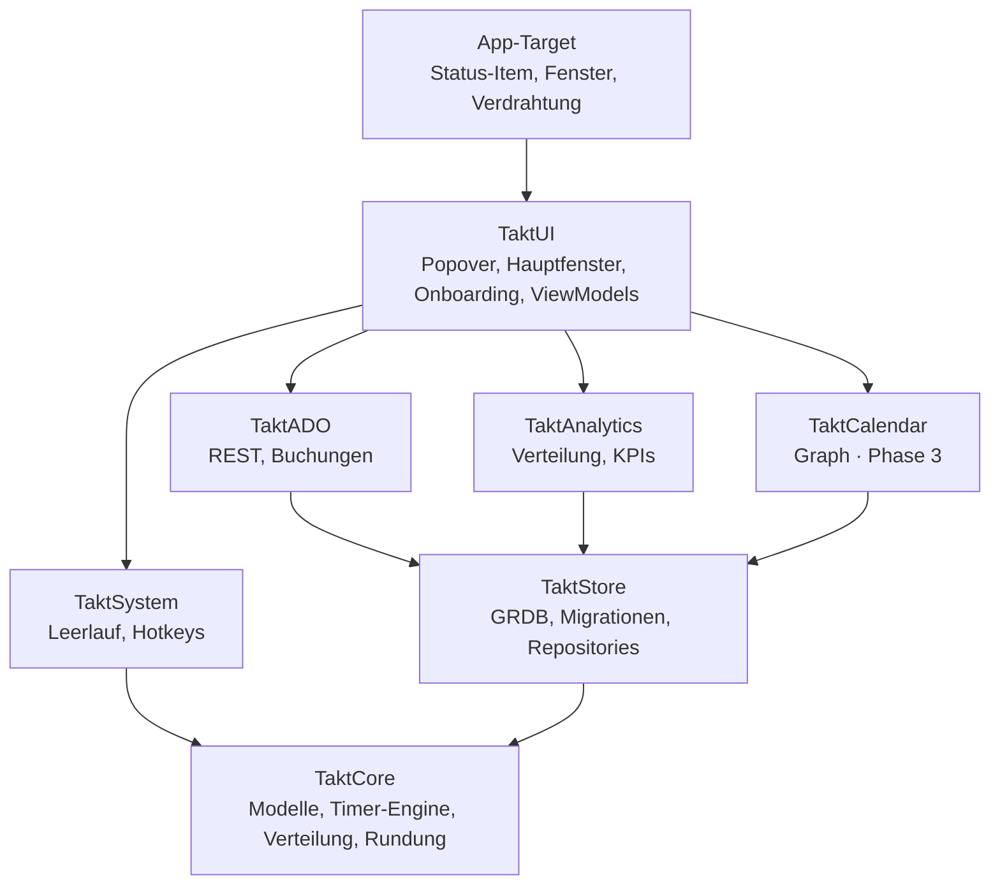
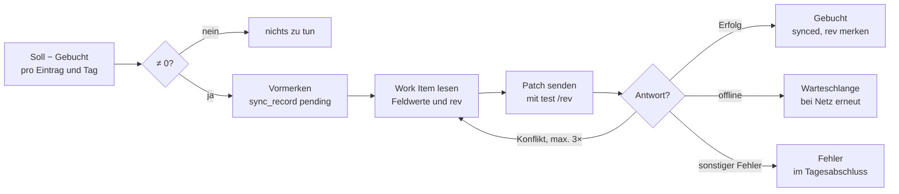

# Takt – Technisches Konzept

Stand: 6. Oktober 2026 · Grundlage: [PRD.md](PRD.md)
Lebende Fassung: https://claude.ai/code/artifact/b71f0458-a7d0-4310-a76f-d499dbcd9231

Takt wird eine native Swift-6-App aus wenigen klar getrennten Modulen: eine reine Domänenschicht mit Timer-Engine, eine GRDB-Persistenz und austauschbare Adapter für System, Azure DevOps und später den Kalender.

## Leitentscheidungen

Gespeichert werden nur rohe UTC-Zeitsegmente; alles Abgeleitete (Zählweise, Rundung, Buchungsbeträge) wird zur Abfragezeit berechnet. Das hält die Daten korrigierbar und die Buchungen reproduzierbar.

| Thema | Entscheidung | Begründung |
| --- | --- | --- |
| Plattform | macOS 26+, Swift 6 mit strikter Concurrency | Aktuelle APIs, ein Design-Pfad, Datenrennen zur Compile-Zeit ausgeschlossen |
| UI-Shell | AppKit `NSStatusItem` + `NSPanel` mit SwiftUI-Inhalt | Popover per Hotkey öffnen und Laufzeit im Menüleisten-Titel zeigen; `MenuBarExtra` kann beides nur eingeschränkt |
| UI-Zustand | SwiftUI mit `@Observable`-Modellen | Wenig Boilerplate, gezielte Neuzeichnung |
| Persistenz | SQLite über GRDB 7, `DatabasePool` im WAL-Modus | Schnelle Aggregationen, explizite Migrationen, `ValueObservation` für reaktive UI |
| Zeitmodell | Segmente mit Start/Ende in UTC-Millisekunden; Tagesgrenzen in lokaler Zeitzone | Sommerzeit- und Reise-sicher |
| Zählweise & Rundung | Zur Abfragezeit berechnet, nie gespeichert | Rückwirkend änderbar, keine Datenmigration |
| Nebenläufigkeit | Timer-Engine und Sync als `actor`; UI auf `@MainActor` | Serialisierte Zustandswechsel ohne Locks |
| ADO-Anmeldung | PAT ab Release 1; Entra ID über MSAL, sobald die App-Registrierung freigegeben ist; Tokens im Schlüsselbund | Registrierung ist beantragt und dauert; PAT ermöglicht den Start sofort |
| Verteilung | Privater Developer-ID-Account, Bundle-ID `de.nilslutz.takt`; notarisiert, Hardened Runtime, ohne App Sandbox; Rollout per MDM | Keine Sandbox-Hürden für Schlüsselbund, Login-Item und verwaltete Einstellungen |
| Projektdatei | XcodeGen (`project.yml`), `.xcodeproj` nicht eingecheckt | Keine Merge-Konflikte in `project.pbxproj`, reproduzierbar in CI |
| Abhängigkeiten | GRDB, KeyboardShortcuts, später MSAL; sonst nur Systemframeworks | Kleine Angriffsfläche, wenig Pflegeaufwand |

## Module

Acht Module in fünf Schichten; jedes Modul darf nur Module unterhalb seiner Schicht nutzen. `TaktCore` kennt kein anderes Modul.



Dienste und Oberfläche sprechen über Protokolle aus `TaktCore` miteinander. Das App-Target setzt die konkreten Implementierungen zusammen, Tests ersetzen sie durch Fälschungen.

## Projektstruktur

Ein Xcode-Projekt (per XcodeGen) für die App, alle Logik in einem lokalen Swift Package mit einem Target pro Modul. So bauen und testen die Module ohne App.

```
takt/
├── project.yml               # XcodeGen-Definition des App-Targets
├── App/                      # App-Target: Lebenszyklus, Verdrahtung
│   ├── TaktApp.swift         # @main, NSApplicationDelegateAdaptor
│   ├── AppDelegate.swift     # Status-Item, Fenster, Login-Item
│   ├── Composition.swift     # baut Store, Engine, Adapter zusammen
│   └── Resources/            # Assets, Localizable.xcstrings
├── Packages/TaktKit/
│   ├── Package.swift
│   ├── Sources/
│   │   ├── TaktCore/         # Modelle, TimerEngine, Allocation, Rounding
│   │   ├── TaktStore/        # GRDB: Schema, Migrationen, Repositories
│   │   ├── TaktAnalytics/    # Auswertungen, Kennzahlen
│   │   ├── TaktSystem/       # Inaktivität, Sleep/Lock, Hotkeys, Notifications
│   │   ├── TaktADO/          # Auth, REST-Client, Suche, BookingService
│   │   ├── TaktCalendar/     # Graph-Kalender (Phase 3)
│   │   └── TaktUI/           # SwiftUI: Popover, Hauptfenster, Onboarding
│   └── Tests/
│       ├── TaktCoreTests/
│       ├── TaktStoreTests/
│       ├── TaktAnalyticsTests/
│       └── TaktADOTests/     # mit aufgezeichneten API-Antworten
├── UITests/                  # XCUITest für Kernabläufe
├── scripts/                  # Release-Skript (signieren, notarisieren, PKG)
└── docs/
```

## Datenbankschema

Kern sind `time_entry` und `segment`; ein laufender Timer ist ein Segment ohne Ende. Mehrere offene Segmente gleichzeitig sind erlaubt und bilden Multitasking ab.

**Konventionen**

- IDs sind UUID-Strings (`TEXT`), damit Export und Import ohne Kollisionen funktionieren. Achtung: GRDB speichert `UUID` standardmäßig als 16-Byte-Blob; immer `uuidString` schreiben.
- Zeiten sind UTC-Millisekunden (`INTEGER`); Anzeige und Tagesgrenzen rechnen in der lokalen Zeitzone.
- Gelöscht wird weich über `deleted_at`, damit Undo und Differenzbuchungen funktionieren; endgültig gelöscht wird nach 30 Tagen.
- Jede Migration ist eine benannte Stufe im GRDB-`DatabaseMigrator` und wird mit Testdaten geprüft. Bestehende Migrationen werden nie geändert.

```sql
CREATE TABLE project (
  id TEXT PRIMARY KEY,
  name TEXT NOT NULL,
  color TEXT NOT NULL,
  icon TEXT,
  source TEXT NOT NULL CHECK (source IN ('local', 'ado')),
  ado_org TEXT, ado_project TEXT, area_path TEXT,
  archived INTEGER NOT NULL DEFAULT 0,
  created_at INTEGER NOT NULL
);

CREATE TABLE task (
  id TEXT PRIMARY KEY,
  project_id TEXT NOT NULL REFERENCES project(id),
  name TEXT NOT NULL,
  archived INTEGER NOT NULL DEFAULT 0
);

CREATE TABLE category (
  id TEXT PRIMARY KEY,
  name TEXT NOT NULL,
  color TEXT NOT NULL,
  icon TEXT,
  archived INTEGER NOT NULL DEFAULT 0
);

CREATE TABLE work_item_link (
  id TEXT PRIMARY KEY,
  org TEXT NOT NULL,
  project TEXT NOT NULL,
  work_item_id INTEGER NOT NULL,
  cached_title TEXT, cached_type TEXT, cached_state TEXT,
  cached_at INTEGER,
  UNIQUE (org, work_item_id)
);

CREATE TABLE time_entry (
  id TEXT PRIMARY KEY,
  title TEXT NOT NULL,                     -- Freitext aus dem Startfeld oder Task-/Work-Item-Titel
  project_id TEXT REFERENCES project(id),
  task_id TEXT REFERENCES task(id),
  category_id TEXT REFERENCES category(id),
  work_item_link_id TEXT REFERENCES work_item_link(id),
  note TEXT,
  counting_mode TEXT CHECK (counting_mode IN ('full', 'split')),  -- NULL = globaler Default
  weight REAL NOT NULL DEFAULT 1 CHECK (weight > 0),
  state TEXT NOT NULL DEFAULT 'stopped' CHECK (state IN ('running', 'paused', 'stopped')),
  created_at INTEGER NOT NULL,
  updated_at INTEGER NOT NULL,
  deleted_at INTEGER
);

CREATE TABLE segment (
  id TEXT PRIMARY KEY,
  entry_id TEXT NOT NULL REFERENCES time_entry(id) ON DELETE CASCADE,
  start_at INTEGER NOT NULL,
  end_at INTEGER,                          -- NULL = läuft
  source TEXT NOT NULL CHECK (source IN ('live', 'manual', 'idle', 'calendar')),
  CHECK (end_at IS NULL OR end_at > start_at)
);
CREATE INDEX segment_time ON segment(start_at, end_at);
CREATE INDEX segment_open ON segment(entry_id) WHERE end_at IS NULL;

CREATE TABLE tag (id TEXT PRIMARY KEY, name TEXT NOT NULL UNIQUE);
CREATE TABLE entry_tag (
  entry_id TEXT NOT NULL REFERENCES time_entry(id) ON DELETE CASCADE,
  tag_id TEXT NOT NULL REFERENCES tag(id),
  PRIMARY KEY (entry_id, tag_id)
);

CREATE TABLE sync_record (
  id TEXT PRIMARY KEY,
  entry_id TEXT NOT NULL REFERENCES time_entry(id),
  work_item_link_id TEXT NOT NULL REFERENCES work_item_link(id),
  local_day TEXT NOT NULL,                 -- 'YYYY-MM-DD'
  field TEXT NOT NULL,                     -- z. B. Microsoft.VSTS.Scheduling.CompletedWork
  delta_seconds INTEGER NOT NULL,          -- kann negativ sein
  status TEXT NOT NULL CHECK (status IN ('pending', 'synced', 'failed')),
  ado_rev INTEGER,
  error TEXT,
  created_at INTEGER NOT NULL,
  synced_at INTEGER
);

CREATE TABLE idle_event (
  id TEXT PRIMARY KEY,
  start_at INTEGER NOT NULL,
  end_at INTEGER NOT NULL,
  entry_ids TEXT NOT NULL DEFAULT '[]',    -- JSON-Array: Einträge, die zu Beginn liefen
  resolution TEXT CHECK (resolution IN ('kept', 'pause', 'discarded', 'reassigned')),
  entry_id TEXT REFERENCES time_entry(id)  -- Ziel bei 'reassigned'
);

CREATE TABLE global_pause (               -- „Alle pausieren“ merkt sich, was fortgesetzt wird
  id TEXT PRIMARY KEY,
  paused_at INTEGER NOT NULL,
  entry_ids TEXT NOT NULL,                 -- JSON-Array
  resumed_at INTEGER
);

CREATE TABLE setting (key TEXT PRIMARY KEY, value TEXT NOT NULL);
```

Für Phase 3 kommen `calendar_link` und `series_rule` hinzu; sie hängen nur an `time_entry` und ändern den Kern nicht.

## Timer-Engine

Die Timer-Engine ist ein `actor` in `TaktCore`. Jeder Befehl läuft als genau eine Datenbank-Transaktion: Der Store liest den aktuellen Timer-Zustand, die Engine berechnet daraus die Änderungen, der Store schreibt sie – alles in derselben Transaktion. So gibt es keinen flüchtigen Zustand und keine Rennen durch Actor-Reentrancy.

```swift
public actor TimerEngine {
    public enum StartMode: Sendable { case switchTo, parallel }

    public func start(_ draft: EntryDraft, mode: StartMode) async throws -> CommandResult<EntryID>
    public func pause(_ id: EntryID) async throws -> TimerUndo
    public func resume(_ id: EntryID, mode: StartMode) async throws -> TimerUndo
    public func stop(_ id: EntryID) async throws -> TimerUndo
    public func pauseAll() async throws -> CommandResult<GlobalPauseID?>
    public func resumeAll(_ pause: GlobalPauseID) async throws -> TimerUndo
    public func resolveIdle(_ event: IdleEvent, _ resolution: IdleResolution) async throws -> TimerUndo
    public func undo(_ undo: TimerUndo) async throws -> TimerUndo   // liefert das Redo
    public func updates() async throws -> AsyncStream<TimerSnapshot>
}

// In TaktCore, implementiert von TaktStore (GRDB) und einem In-Memory-Store für Tests.
public protocol TimerStore: Sendable {
    func snapshot() async throws -> TimerSnapshot
    func update<T: Sendable>(
        _ body: @Sendable (TimerSnapshot) throws -> TimerUpdate<T>
    ) async throws -> T   // liest, ruft body, schreibt body.changes – eine Transaktion
}
```

Ein `TimerChange` beschreibt genau eine Zeile als Paar aus altem und neuem Stand (`nil` vorher = einfügen, `nil` nachher = löschen). Der Store schreibt eine Änderung nur, wenn die gespeicherte Zeile noch dem alten Stand entspricht; sonst wirft er `TimerStoreError.conflict` und schreibt nichts. Zeiten sind im Kern `Timestamp` (UTC-Millisekunden), damit Zeilen nach dem Speichern exakt vergleichbar bleiben.

| Befehl | Wirkung in der Datenbank |
| --- | --- |
| `start` mit `switchTo` | Offene Segmente anderer Einträge schließen (Ende = jetzt, Zustand `paused`), neuen Eintrag mit offenem Segment anlegen |
| `start` mit `parallel` | Nur neuen Eintrag mit offenem Segment anlegen |
| `pause` | Offenes Segment schließen, Zustand `paused` |
| `resume` | Neues Segment ab jetzt, Zustand `running`; bei `switchTo` andere pausieren |
| `stop` | Offenes Segment schließen, Zustand `stopped` |
| `pauseAll` / `resumeAll` | Laufende Einträge in `global_pause` merken und genau diese wieder fortsetzen |

**Uhr.** Die Engine liest die Zeit nie direkt, sondern über ein injiziertes `TaktClock`-Protokoll. Tests nutzen eine manuelle Uhr.

**Undo.** Jeder Befehl liefert seine Umkehrung (`TimerUndo`: die vertauschten Änderungen in umgekehrter Reihenfolge), die der `UndoManager` des Fensters bzw. der Undo-Stapel des Popovers aufnimmt. Das Popover führt einen eigenen Stapel, weil die Befehle asynchron laufen und ein `UndoManager` das Redo nur synchron registrieren kann; mehrere Befehle einer Aktion („Alle stoppen“) werden zu einem Undo zusammengefasst. Wurde eine betroffene Zeile inzwischen anders geändert, schlägt das Undo mit einem Konflikt fehl, statt neuere Daten zu überschreiben. Damit funktionieren „Rückgängig ⌘Z“ im Toast und in der Timeline gleich.

**Absturz und Neustart.** Die Engine schreibt jede Minute einen Heartbeat in `setting` (Schlüssel `engine.heartbeat`, UTC-Millisekunden); die App ruft dazu `TimerEngine.heartbeat()` auf und beim Start einmal `recoverAfterLaunch(idleThreshold:)`. Findet sie beim Start offene Segmente und liegt der letzte Heartbeat länger zurück als die Inaktivitätsschwelle, schließt sie die Segmente beim Heartbeat und erzeugt ein `idle_event`. Der Nutzer entscheidet dann im Inaktivitätsdialog.

**Anzeige ohne Dauer-Polling.** Die Engine sendet nur Zustandswechsel. Die Laufzeit rechnet die UI aus abgeschlossener Dauer plus Startzeit des offenen Segments: im sichtbaren Popover per `TimelineView` sekündlich, in der Menüleiste einmal pro Minute, ausgerichtet auf die Minutengrenze.

### Zählweise paralleler Zeit

Die Zählweise wird in `TaktCore.Allocation` zur Abfragezeit berechnet. Ein Sweep über alle Segmentgrenzen eines Zeitraums zerlegt ihn in Intervalle I mit der Menge S(I) gleichzeitig laufender Einträge. Ein Eintrag im Modus „Voll“ erhält die volle Intervalldauer, ein Eintrag im Modus „Geteilt“ seinen Anteil nach Gewicht:

```
t_e = Σ_{I ∋ e} |I| · w_e / Σ_{s ∈ S(I)} w_s
```

Der Sweep läuft in O(n log n) über die Segmente des Zeitraums. Rundung (z. B. auf 15 min, kaufmännisch) passiert erst danach, pro Eintrag und lokalem Tag, und nur für Export und ADO.

## Inaktivität, Ruhezustand und Shortcuts

`TaktSystem` kapselt alle Systemsignale hinter Protokollen, damit die Engine sie in Tests simuliert bekommt. Keines der Signale braucht Bedienungshilfen- oder Bildschirmaufnahme-Rechte.

| Signal | Quelle | Verhalten |
| --- | --- | --- |
| Leerlauf | `CGEventSource.secondsSinceLastEventType(.hidSystemState, eventType: .null)`, alle 30 s abgefragt, nur wenn ein Timer läuft | Ab Schwelle (Default 10 min) Beginn der Inaktivität = letzte Eingabe; Dialog erst bei Rückkehr |
| Ruhezustand | `NSWorkspace.willSleepNotification` / `didWakeNotification` | Wie Leerlauf, Beginn = Einschlafzeitpunkt |
| Bildschirmsperre | `DistributedNotificationCenter`: `com.apple.screenIsLocked` / `com.apple.screenIsUnlocked` | Wie Leerlauf; optional automatisch als Pause werten |
| Uhrzeit- oder Zeitzonenwechsel | `NSSystemClockDidChange`, `NSSystemTimeZoneDidChange` | Anzeige neu berechnen; gespeicherte UTC-Zeiten bleiben gültig |
| Globale Shortcuts | Paket KeyboardShortcuts (nutzt `RegisterEventHotKey`) | Funktionieren in jeder App; Nutzer nimmt sie in den Einstellungen neu auf |
| Hinweise | `UserNotifications` mit Aktions-Buttons | Inaktivität, Langläufer (> 10 h), Tagesabschluss, später Terminbeginn |

Kurze Unterbrechungen unter der Schwelle zählen weiter als Arbeitszeit.

## Menüleiste und UI-Architektur

Die App läuft als Menüleisten-App ohne Dock-Symbol (`LSUIElement`); das Dock-Symbol erscheint nur, solange das Hauptfenster offen ist. Das Popover öffnet in unter 150 ms, weil sein View-Baum einmal erzeugt und danach nur ein- und ausgeblendet wird.

- **Status-Item:** `NSStatusItem` mit Symbol und optionalem Laufzeittext. Der Titel wird einmal pro Minute aktualisiert.
- **Popover:** `NSPanel` unter dem Status-Item mit `NSHostingView`. Es nimmt Tastatureingaben an, schließt bei Klick außerhalb und lässt sich per Hotkey öffnen.
- **Hauptfenster:** SwiftUI-`Window` mit `NavigationSplitView` (Seitenleiste, Inhalt, Inspektor).
- **Zustand:** pro Bildschirm ein `@Observable`-ViewModel auf dem `@MainActor`. Es abonniert Daten über GRDB-`ValueObservation` bzw. `TimerEngine.updates()` und schickt Befehle an die Engine.
- **Suche:** ein `SearchCoordinator` fragt lokale Tasks, den Work-Item-Cache und die ADO-Suche parallel ab. Eingaben werden mit 250 ms entprellt; lokale Treffer erscheinen sofort, ADO-Treffer werden nachgeladen.
- **Erscheinungsbild:** Farben als Asset-Katalog mit Hell- und Dunkel-Variante (siehe [DESIGN.md](DESIGN.md)), Systemschrift und Systemmaterialien.
- **Testbetrieb:** `TAKT_DATA_DIR` legt die Datenbank in ein anderes Verzeichnis. In Debug-Builds öffnet `-openPopover YES` das Popover beim Start und `-appearance dark|light` erzwingt das Erscheinungsbild – für Screenshots und UI-Tests.
- **Start bei Anmeldung:** `SMAppService.mainApp`, im Onboarding vorausgewählt.

## Azure DevOps

Takt bucht nie absolute Werte, sondern immer die Differenz zwischen dem Soll aus den lokalen Einträgen und dem bereits Gebuchten. Jede Buchung ist mit einer eindeutigen Kennung im Work-Item-Verlauf markiert und lässt sich nach einem Absturz wiederfinden. So entstehen keine Doppelbuchungen.

### Anmeldung

- **PAT (ab Release 1):** Basic-Auth mit leerem Benutzernamen, Scope „Work Items: Read & Write“. Takt prüft beim Speichern die Gültigkeit und zeigt das Ablaufdatum; 14 Tage vorher erinnert es an die Erneuerung.
- **Entra ID (sobald registriert):** MSAL mit dem Scope `499b84ac-1321-427f-aa17-267ca6975798/.default` (Ressource Azure DevOps), Redirect-URI `msauth.de.nilslutz.takt://auth`. Client-ID und Tenant-ID kommen per MDM-Konfiguration; fehlen sie, blendet Takt die Option aus.
- Beide Wege liefern dem REST-Client nur einen `AuthorizationProvider`; der Rest des Codes kennt den Unterschied nicht.
- Tokens und PAT liegen im Schlüsselbund.

### Endpunkte (`api-version=7.1`)

| Zweck | Aufruf |
| --- | --- |
| Suche nach Titel oder ID (Fallback) | `POST {org}/{project}/_apis/wit/wiql?$top=20` mit `[System.Title] CONTAINS @text OR [System.Id] = @id`, sortiert nach Änderungsdatum |
| Volltextsuche (wenn verfügbar) | `POST almsearch.dev.azure.com/{org}/{project}/_apis/search/workitemsearchresults` |
| Eigene Teams | `GET {org}/_apis/projects/{project}/teams?$mine=true` |
| Vorschläge | je Team `POST {org}/{project}/{team}/_apis/wit/wiql` mit `[System.AssignedTo] = @Me AND [System.IterationPath] = @CurrentIteration`; Ergebnisse zusammengeführt |
| Details für Vorschau | `POST {org}/_apis/wit/workitemsbatch` mit IDs und Feldliste (max. 200 IDs je Aufruf) |
| Felder eines Typs | `GET {org}/{project}/_apis/wit/workitemtypes/{type}/fields` |
| Lesen vor dem Buchen | `GET {org}/_apis/wit/workitems/{id}?fields=…` liefert Feldwerte und `rev` |
| Buchen | `PATCH {org}/_apis/wit/workitems/{id}` als JSON Patch (`application/json-patch+json`) |
| Wiederfinden nach Absturz | `GET {org}/_apis/wit/workitems/{id}/updates` |

Eine Buchung ist ein einziger JSON-Patch. Der Kommentar steht im selben Patch und landet damit in derselben Revision wie die Zeit:

```json
[
  { "op": "test", "path": "/rev", "value": 57 },
  { "op": "add",  "path": "/fields/Microsoft.VSTS.Scheduling.CompletedWork", "value": 7.75 },
  { "op": "add",  "path": "/fields/Microsoft.VSTS.Scheduling.RemainingWork", "value": 2.75 },
  { "op": "add",  "path": "/fields/System.History", "value": "Takt: +0,25 h am 06.10.2026 · Ursache im Refresh-Interceptor gefunden [takt:3f9c…]" }
]
```

**Zur Laufzeit erkannt, nicht konfiguriert**

- **Suche:** Takt prüft einmal pro Organisation, ob die Work-Item-Suche verfügbar ist. Ja: Volltextsuche über Titel und Beschreibung. Nein: WIQL mit `CONTAINS` auf den Titel.
- **Zeitfelder:** Takt liest pro Work-Item-Typ die verfügbaren Felder und schlägt das Feld für erledigte und offene Arbeit vor. Gibt es kein eindeutiges Feld, fragt die App einmalig nach. Ein Typ ohne passendes Feld bekommt nur den Kommentar.

### Buchungsablauf

1. Für jedes Paar aus Eintrag und lokalem Tag mit verknüpftem Work Item: Soll = gerundete, zugeteilte Zeit.
2. Gebucht = Summe der `delta_seconds` aller erfolgreichen `sync_record` zu diesem Paar.
3. Differenz = Soll − Gebucht; bei 0 passiert nichts. Eine negative Differenz (Eintrag gekürzt oder gelöscht) reduziert Completed Work wieder.
4. `sync_record` mit Status `pending` anlegen, dann Work Item lesen und den Patch mit `test /rev` senden.
5. Erfolg: Status `synced` mit neuer Revision. Revisionskonflikt: neu lesen und bis zu dreimal wiederholen. Keine Verbindung: Datensatz bleibt `pending`; die Warteschlange sendet erneut, sobald `NWPathMonitor` Netz meldet (exponentielles Backoff, `Retry-After` wird beachtet). Andere Fehler: Status `failed`, sichtbar im Tagesabschluss.
6. Beim App-Start werden `pending`-Datensätze zuerst im Verlauf des Work Items gesucht (Kennung `takt:<id>`). Gefunden heißt bereits gebucht, sonst wird neu gesendet.



## Analysen

Analysen laden die Segmente eines Zeitraums mit einer einzigen indizierten Abfrage und verteilen die Zeit dann in Swift. Ein Jahr Daten sind grob 20.000 bis 50.000 Segmente; Ziel bleibt unter 500 ms für 12 Monate.

```sql
SELECT s.start_at, COALESCE(s.end_at, :now) AS end_at,
       e.id, e.project_id, e.category_id, e.work_item_link_id,
       COALESCE(e.counting_mode, :default_mode) AS mode, e.weight
FROM segment s
JOIN time_entry e ON e.id = s.entry_id
WHERE e.deleted_at IS NULL
  AND s.start_at < :range_end
  AND COALESCE(s.end_at, :now) > :range_start
ORDER BY s.start_at;
```

- Segmente, die über die Zeitraumgrenzen ragen, werden gekappt; über Mitternacht laufende Segmente werden an der lokalen Tagesgrenze geteilt.
- Gruppierung nach Projekt, Kategorie, Tag, Work Item, Wochentag und Stunde passiert auf dem Ergebnis der Verteilung.
- **Fokusblöcke:** zusammenhängende Arbeit an einem Eintrag ≥ 25 min ohne parallelen Eintrag.
- **Kontextwechsel:** Anzahl der Wechsel des aktiven Eintrags pro Tag; Pausen zählen nicht als Wechsel.
- Ergebnisse vergangener Tage werden pro Tag zwischengespeichert und beim Ändern eines Segments für genau diesen Tag verworfen.
- Diagramme zeichnet Swift Charts; Export als CSV und JSON nutzt dieselbe Verteilung wie die Ansicht.

## Sicherheit, Verteilung und Updates

Takt hat keine eigene Server-Komponente; das schützenswerte Gut sind die lokale Datenbank und die ADO-Tokens.

- **Daten:** Datenbank in `~/Library/Application Support/Takt/`, geschützt durch FileVault. Tägliches Backup per SQLite-Backup-API, 14 Generationen (`takt-YYYY-MM-DD.sqlite`, lokaler Tag).
- **Export/Import:** JSON mit allen Tabellen als Zeilen mit Rohwerten und der Liste der angewandten Migrationen. Neue Tabellen und Spalten sind ohne Zusatzcode abgedeckt. Der Import ersetzt alle Daten in einer Transaktion, prüft Fremdschlüssel beim Commit und lehnt Archive eines neueren Schemas ab.
- **Geheimnisse:** Tokens und PAT nur im Schlüsselbund, nie in Datei, Log oder Export.
- **Netzwerk:** nur HTTPS zu `dev.azure.com` (und in Phase 3 zu `graph.microsoft.com`). Keine Telemetrie.
- **Signatur:** Developer ID (privater Account), Hardened Runtime, notarisiert und gestapelt. Vorerst lokal per `scripts/release-local.sh`, siehe [RELEASING.md](RELEASING.md).
- **Rollout:** PKG über Intune oder Jamf. Neue Versionen verteilt ebenfalls das MDM; kein In-App-Updater.
- **Verwaltete Einstellungen:** Das MDM kann per Konfigurationsprofil Werte vorgeben (ADO-Organisation, Rundung, Buchungsmodus, Entra-Client-ID). Takt liest sie über `UserDefaults` und sperrt vorgegebene Felder.
- **Logging:** `os.Logger` mit Subsystem `de.nilslutz.takt`; Titel, Notizen und Tokens werden als privat markiert.

## Teststrategie

Der Schwerpunkt liegt auf `TaktCore` und dem Buchungsablauf, weil Fehler dort falsche Zeiten oder falsche ADO-Buchungen erzeugen.

| Ebene | Werkzeug | Was |
| --- | --- | --- |
| Domäne | Swift Testing | Zustandswechsel der Engine, Verteilung „Voll“/„Geteilt“, Rundung, Tagesgrenzen, Sommerzeitwechsel |
| Eigenschaften | Swift Testing mit zufällig erzeugten Segmenten (fester Seed) | Summe „Geteilt“ = Wanduhrzeit; „Voll“ ≥ „Geteilt“; Rundung nie negativ |
| Persistenz | GRDB mit In-Memory-Datenbank | Jede Migration gegen Datenstände früherer Versionen; Fremdschlüssel und Constraints |
| ADO | `URLProtocol`-Stub mit aufgezeichneten Antworten | Konflikt, Offline, 401, Wiederfinden nach Absturz, negative Differenz |
| System | Fake-Implementierung der `TaktSystem`-Protokolle | Inaktivität, Ruhezustand, Sperre, Uhrzeitwechsel ohne echtes Warten |
| UI | XCUITest | Timer starten, wechseln, pausieren, beenden, Tagesabschluss |
| Performance | `measure` mit 12 Monaten Testdaten | Analyse < 500 ms, Popover-Daten < 50 ms |

## Entscheidungen & offene Punkte

| Frage | Entscheidung |
| --- | --- |
| Entra-App-Registrierung | Wird bei den Entra-ID-Admins beantragt; bis dahin PAT |
| Felder für erledigte und offene Arbeit | Pro Work-Item-Typ zur Laufzeit aus ADO gelesen |
| Work-Item-Suche | Zur Laufzeit erkannt, WIQL als Fallback |
| Vorschläge bei mehreren Teams | Aktuelle Iteration aller eigenen Teams |
| Bundle-ID und Logging-Präfix | `de.nilslutz.takt` |
| Signatur | Privater Developer-ID-Account, vorerst lokal |

- [ ] Client-ID und Tenant-ID nach Freigabe der Entra-Registrierung eintragen (MDM-Konfiguration)
- [ ] Mit Arbeitgeber und IT klären, dass eine privat entwickelte und signierte App per MDM verteilt werden darf, und wem die Rechte am Code gehören
